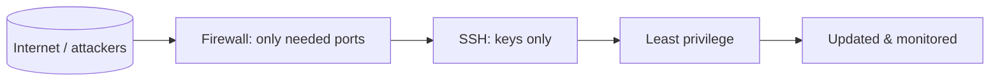

# Security Basics

## 1. What Is This?

The foundational ideas of Linux security: what you're protecting, who the attackers are, and the principles (least privilege, defense in depth, keep-it-updated) that guide every decision.

## 2. Why Is This Needed?

A server on the internet is scanned and probed within minutes of going live. Understanding the basics lets you make sensible choices instead of either ignoring security or blindly copying random commands.

## 3. Simple Layman Explanation

Securing a server is like securing a house: lock the doors (firewall), use good keys not flimsy ones (SSH keys), don't give everyone a master key (least privilege), and fix broken locks promptly (updates).

## 4. Technical Explanation

Core principles:
- **Least privilege** — give each user/service only the access it needs.
- **Defense in depth** — multiple layers (firewall + keys + updates + monitoring).
- **Attack surface reduction** — fewer open ports/services = fewer ways in.
- **Patch management** — apply security updates promptly.
- **Auditing & logging** — know who did what (`/var/log/auth.log`).

Common threats: brute-force SSH, unpatched vulnerabilities, weak/reused passwords, exposed services, privilege escalation.

## 5. Real-World Example

A default cloud VM with password SSH gets thousands of brute-force attempts daily (visible in `/var/log/auth.log`). Switching to key-only SSH and a firewall eliminates almost all of it.

## 6. Diagram



## 7. Commands

```bash
sudo grep "Failed password" /var/log/auth.log | wc -l   # brute-force attempts
who                          # who is logged in now
last | head                  # recent logins
sudo ss -ltnp                # exposed listening services
sudo apt update && apt list --upgradable   # pending security updates
sudo -l                      # what privileges do I have?
```

## 8. Command Explanation

- `grep "Failed password" auth.log | wc -l` → counts failed logins (attack volume).
- `who` / `last` → current and recent logins (spot unexpected access).
- `ss -ltnp` → lists exposed services — your attack surface.
- `apt list --upgradable` → shows pending updates, including security ones.
- `sudo -l` → audits your own privileges.

## 9. Practice Tasks

1. Count failed SSH logins on your server with the `grep` above.
2. Run `who` and `last` to review access.
3. `ss -ltnp` — list every listening service and question whether each is needed.
4. Check for pending updates.

## 10. Common Mistakes

- Treating security as optional on "small" or "test" servers (attackers don't care).
- Exposing services to the internet that should be local-only.
- Never reviewing logs or installed services.

## 11. Troubleshooting

- **Server compromised signs** → unexpected logins (`last`), unknown processes (`ps`), strange listeners (`ss`), high outbound traffic. Isolate and rebuild from a known-good state.
- **Too many services exposed** → disable/uninstall what you don't use.

## 12. Best Practices

- Apply least privilege and defense in depth everywhere.
- Reduce attack surface: close ports, remove unused services.
- Patch regularly; review auth logs.
- Use keys, not passwords (next topic).

## 13. Quick Recap

- Principles: least privilege, defense in depth, small attack surface, patching, auditing.
- The internet attacks every server; basics stop most of it.
- Know your exposed services and who's logging in.

## 14. References

- CIS Benchmarks: https://www.cisecurity.org/cis-benchmarks
- Ubuntu security: https://ubuntu.com/security
