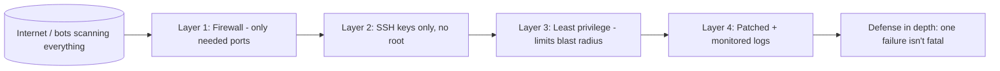

# Security Basics

## 1. What Is This?

The foundational ideas of Linux security: what you're protecting, who the attackers are, and the principles (least privilege, defense in depth, keep-it-updated) that guide every decision.

## 2. Why Is This Needed?

A server on the internet is scanned and probed within minutes of going live. Understanding the basics lets you make sensible choices instead of either ignoring security or blindly copying random commands.

## 3. Simple Layman Explanation

Securing a server is like securing a house: lock the doors (firewall), use good keys not flimsy ones (SSH keys), don't give everyone a master key (least privilege), and fix broken locks promptly (updates). No single lock makes a house safe — it's the *combination*, so that if one fails the others still hold.

## 4. Technical Explanation

Core principles:
- **Least privilege** — give each user/service only the access it needs.
- **Defense in depth** — multiple layers (firewall + keys + updates + monitoring).
- **Attack surface reduction** — fewer open ports/services = fewer ways in.
- **Patch management** — apply security updates promptly.
- **Auditing & logging** — know who did what (`/var/log/auth.log`).

Common threats: brute-force SSH, unpatched vulnerabilities, weak/reused passwords, exposed services, privilege escalation.

## 5. How It Works Under the Hood

Security isn't one setting; it's a chain of independent barriers, and understanding *why* each exists makes them stick:

- **Why "the internet attacks every server" is literally true.** The public IPv4 space is small enough (~4 billion addresses) that automated bots scan *all* of it continuously. The moment your server has a public IP and an open port 22, botnets find it — often within minutes — and start trying common username/password pairs (`root`/`root`, `admin`/`admin`). This isn't targeted; it's a dragnet. That's why `/var/log/auth.log` on a fresh cloud VM fills with thousands of `Failed password` lines a day. You're not special; you're just *reachable*.
- **Authentication vs authorization — two different gates.** *Authentication* answers "who are you?" (login, SSH key check); *authorization* answers "what are you allowed to do?" (file permissions from Module 04, sudo rules). A breach usually means an attacker passed *authentication* (guessed a password, stole a key). Least privilege is what limits the damage *after* that gate — it's the authorization layer that turns "they got in" into "they got in as `www-data` and could do almost nothing."
- **Defense in depth = assume each layer will fail.** No single control is perfect: firewalls get misconfigured, keys leak, patches lag. Layering means an attacker must defeat *several* independent controls in sequence. Disable password SSH *and* run a firewall *and* keep patched *and* run services unprivileged — so one mistake isn't game over. This is why "I have a firewall, I'm fine" is a dangerous half-measure.
- **Attack surface is the sum of everything reachable.** Every listening service (`ss -ltnp` from Module 07) is code an attacker can talk to, and any bug in it is a way in. A database bound to `0.0.0.0:3306` on the public internet is an open invitation; the *same* database bound to `127.0.0.1` is nearly unreachable. Reducing attack surface — closing ports, uninstalling unused services, binding to localhost — removes whole categories of attack without any clever defense.
- **Why patching is the highest-ROI habit.** Most real breaches exploit *known* vulnerabilities with public patches available — the victim simply hadn't updated. A patch (Module 06) closes a door attackers already know about. Unpatched software is the single most common breach cause, which is why "keep it updated" ranks alongside "use keys."

The through-line: authentication keeps most attackers out, authorization + least privilege limits the ones who get through, small attack surface gives them less to attack, and patching + monitoring keep the whole thing current and observed.

## 6. Diagram



## 7. Real-World Examples

**1. The everyday case.** A default cloud VM with password SSH gets thousands of brute-force attempts daily (visible in `/var/log/auth.log`). Switching to key-only SSH and a firewall eliminates almost all of it — the log goes quiet overnight.

**2. Measuring the attack volume yourself:**

```
$ sudo grep "Failed password" /var/log/auth.log | wc -l
8423                                    # failed SSH logins in the current log
$ sudo grep "Failed password" /var/log/auth.log | tail -1
Jul  2 11:03:22 web01 sshd[20144]: Failed password for root from 185.42.7.9 port 51022 ssh2
$ sudo ss -ltnp | grep -v 127.0.0.1
LISTEN 0 128 0.0.0.0:22   0.0.0.0:*  users:(("sshd",pid=812,fd=3))    # only SSH exposed — good
```

8,423 failed logins is a *typical* day for an internet-facing box — the dragnet from Section 5. Only port 22 is exposed, so the attack surface is minimal.

**3. War story — the "test" server that became a crypto miner.** A team spun up a quick VM for a demo, left password SSH on with a weak `admin` password, "because it's just a test box." Within 48 hours a bot guessed the password, and the CPU pegged at 100% — a cryptominer, running as the compromised user, phoning home. Nothing important was on the box, but it was now attacking *others* and racking up cloud bills. The lesson from Section 5: attackers don't care whether a server is "important"; they care that it's reachable. Keys-only SSH and a firewall would have stopped it cold.

## 8. Worked Walkthrough

A five-minute security posture check on any server:

```
$ sudo grep "Failed password" /var/log/auth.log | wc -l    # 1. how much are we being attacked?
6120
$ who ; last | head -3                                     # 2. who is / was logged in?
alice    pts/0        203.0.113.9      11:00   still logged in
alice    pts/0        203.0.113.9      Wed 09:15 - 10:40 (01:25)
$ sudo ss -ltnp                                            # 3. what's exposed? (attack surface)
LISTEN 0 128 0.0.0.0:22    0.0.0.0:*  users:(("sshd",...))
LISTEN 0 128 127.0.0.1:5432 0.0.0.0:* users:(("postgres",...))   # DB is localhost-only — good
$ apt list --upgradable 2>/dev/null | grep -i secur | head    # 4. pending security patches?
openssl/jammy-security 3.0.2-0ubuntu1.15 amd64 [upgradable from: 3.0.2-0ubuntu1.12]
$ sudo -l | tail -2                                        # 5. what can I escalate to?
User alice may run the following commands:
    (ALL : ALL) ALL
```

Five commands answered: how hard we're attacked, who's here, what's exposed, what needs patching, and who has power — the whole Section 5 model in one sweep.

## 9. Commands

```bash
sudo grep "Failed password" /var/log/auth.log | wc -l   # brute-force attempts
who                          # who is logged in now
last | head                  # recent logins
sudo ss -ltnp                # exposed listening services (attack surface)
sudo apt update && apt list --upgradable   # pending security updates
sudo -l                      # what privileges do I have?
```

Sample output (dummy values, for reference):

```text
$ sudo grep "Failed password" /var/log/auth.log | wc -l
8423

$ who
alice    pts/0        2026-07-02 11:00 (203.0.113.9)

$ sudo ss -ltnp
State  Recv-Q Send-Q Local Address:Port Peer Address:Port Process
LISTEN 0      128          0.0.0.0:22        0.0.0.0:*     users:(("sshd",pid=812,fd=3))
LISTEN 0      128        127.0.0.1:5432      0.0.0.0:*     users:(("postgres",pid=1120,fd=5))

$ sudo -l
User alice may run the following commands on web01:
    (ALL : ALL) ALL
```

## 10. Command Explanation

- `grep "Failed password" auth.log | wc -l` → counts failed logins (attack volume; the dragnet from Section 5).
- `who` / `last` → current and recent logins — spot unexpected access early.
- `ss -ltnp` → lists exposed services — literally your attack surface (Section 5).
- `apt list --upgradable` → shows pending updates, including security ones (highest-ROI fix).
- `sudo -l` → audits your own privileges (the authorization layer).

## 11. In Production (DevOps Context)

- **Hardening is baked into images, not done by hand:** production servers come from a golden image / Terraform / Ansible where keys-only SSH, firewall, and unattended-upgrades are already set — so every box starts secure (Module 13).
- **Log shipping + alerting:** `auth.log` and friends are shipped to a central system (ELK, CloudWatch, Loki) where a spike in `Failed password` or an unexpected login triggers an alert — monitoring at fleet scale.
- **Attack-surface reviews are routine:** "what's listening and does it need to be?" (`ss -ltnp`) is a standard audit item; databases and internal services bind to private networks, never `0.0.0.0`.
- **Compromise response is rebuild, not clean:** because you can't fully trust a breached host, the production answer is to isolate it, capture forensics, and **rebuild from a known-good image** — which is only painless if the server was disposable to begin with.

## 12. Practice Tasks

1. Count failed SSH logins on your server with the `grep` above.
2. Run `who` and `last` to review access.
3. `ss -ltnp` — list every listening service and question whether each is needed (which are `0.0.0.0` vs `127.0.0.1`?).
4. Check for pending security updates.

## 13. Common Mistakes

- Treating security as optional on "small" or "test" servers — attackers don't care (the war story).
- Exposing services to the internet that should be local-only (`0.0.0.0` vs `127.0.0.1` — Section 5).
- Relying on a single control ("I have a firewall") instead of layering (defense in depth).
- Never reviewing logs or installed services.

## 14. Troubleshooting

**Signs of compromise**
- **Symptoms:** unexpected logins (`last`), unknown processes (`ps`), strange listeners (`ss`), high CPU/outbound traffic.
- **Check:** `last`, `ps aux --sort=-%cpu | head`, `sudo ss -ltnp`, cloud egress metrics.
- **Fix:** isolate the host (cut network / security group), capture evidence, and **rebuild from a known-good state** — don't try to "clean" a breached box.
- **Prevention:** keys-only SSH, firewall, patching, least privilege, and log monitoring (this module).

**Too many services exposed**
- **Symptoms:** `ss -ltnp` shows listeners on `0.0.0.0` you don't recognize.
- **Fix:** disable/uninstall what you don't use (Module 06); bind the rest to `127.0.0.1` or a private interface.

## 15. Best Practices

- Apply least privilege and defense in depth everywhere — assume any single layer can fail.
- Reduce attack surface: close ports, remove unused services, bind internal services to localhost.
- Patch regularly (highest ROI); review auth logs.
- Use keys, not passwords (next topic); treat compromised hosts as disposable.

## 16. Connects To

- **Prev:** [Module 12 — Linux Security Basics](README.md). **Next:** [SSH Basics](ssh-basics.md).
- **The layers:** [SSH Basics](ssh-basics.md), [Firewall Basics](firewall-basics-ufw-firewalld.md), [Least Privilege](least-privilege.md), [Security Best Practices](security-best-practices.md).
- **Authorization foundation:** [File Permissions](../04-users-groups-permissions/file-permissions.md), [sudo & Root](../04-users-groups-permissions/sudo-and-root.md).
- **Attack surface / logs:** [netstat/ss/lsof](../07-networking-basics/netstat-ss-lsof.md), [Linux Logs Overview](../09-logs-monitoring-troubleshooting/linux-logs-overview.md); **patching:** [Install/Remove/Update](../06-package-management/install-remove-update-packages.md).

## 17. Quick Recap

- The internet attacks *every* reachable server; basics stop the vast majority.
- Principles: least privilege, defense in depth, small attack surface, patching, auditing.
- Know your exposed services (`ss -ltnp`) and who's logging in (`who`/`last`); layer controls so one failure isn't fatal.

## 18. References

- CIS Benchmarks: https://www.cisecurity.org/cis-benchmarks
- Ubuntu security: https://ubuntu.com/security

<!-- NAV-FOOTER -->

---

### 🧭 Navigation

| Previous | Up | Next |
|:---|:---:|---:|
| ⬅️ Prev: [Module 12 — Linux Security Basics](README.md) | ⬆️ Module: [Module 12 — Linux Security Basics](README.md) | ➡️ Next: [SSH Basics](ssh-basics.md) |
