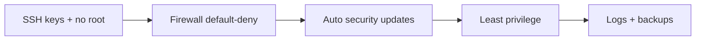

# Security Best Practices

## 1. What Is This?

A practical, beginner-friendly **hardening checklist** for a Linux server, pulling together SSH, firewall, least privilege, updates, and monitoring.

## 2. Why Is This Needed?

Security is a set of habits, not a single action. A checklist ensures you don't forget a critical step when setting up or reviewing a server.

## 3. Simple Layman Explanation

It's a **pre-flight checklist** for your server: tick each item before exposing it to the world, and revisit periodically — like checking locks, alarms, and smoke detectors in a house.

## 4. Technical Explanation — The Checklist

| # | Practice | Why |
|---|----------|-----|
| 1 | Use SSH keys; disable password & root login | Stops brute-force |
| 2 | Enable a firewall (default deny) | Shrinks attack surface |
| 3 | Open only needed ports (22/80/443) | Fewer ways in |
| 4 | Keep the system patched | Closes known vulnerabilities |
| 5 | Apply least privilege (no daily root) | Limits blast radius |
| 6 | Run services as non-root users | Contains compromises |
| 7 | Strong, unique passwords; secrets `600` | Prevents easy access |
| 8 | Review auth logs / failed logins | Detect attacks early |
| 9 | Enable automatic security updates | Stay patched effortlessly |
| 10 | Take backups & test restores | Recover from incidents |

## 5. Real-World Example

A new production server: keys-only SSH, ufw allowing 22/80/443, unattended security upgrades on, Nginx as `www-data`, nightly backups (Module 11), and weekly `auth.log` review. That covers the threats that hit most servers.

## 6. Diagram



## 7. Commands

```bash
# 1-3 SSH & firewall (see ssh-basics & firewall topics)
sudo ufw default deny incoming && sudo ufw allow 22,80,443/tcp && sudo ufw enable

# 4 & 9 Updates
sudo apt update && sudo apt upgrade -y
sudo apt install -y unattended-upgrades        # auto security updates (Debian/Ubuntu)
sudo dpkg-reconfigure -plow unattended-upgrades

# 5-6 Least privilege
sudo -l ; ps -eo user,comm | sort -u | head

# 8 Monitoring
sudo grep "Failed password" /var/log/auth.log | tail
who ; last | head

# 10 Backups (Module 11)
crontab -l
```

## 8. Command Explanation

- `unattended-upgrades` → automatically installs security patches (set-and-forget patching).
- The ufw one-liner → applies default-deny + the standard allow list in one go.
- `grep "Failed password"` / `last` → routine log review for intrusion signs.
- `sudo -l` / `ps -eo user,comm` → verify least privilege is actually in place.

## 9. Practice Tasks

1. Walk the 10-item checklist against a test server; tick what's done.
2. Enable automatic security updates.
3. Apply the ufw default-deny + allow list.
4. Review `auth.log` for failed logins.

## 10. Common Mistakes

- Doing some items but skipping updates (the most common breach cause).
- One-time hardening with no periodic review.
- Forgetting backups are part of security (ransomware/recovery).

## 11. Troubleshooting

- **Locked out** → recover via cloud console; re-check SSH/firewall changes (test in a second session next time).
- **Unattended upgrades breaking things** → configure it to apply **security** updates only.
- **Unsure of exposure** → re-run `ss -ltnp` and the firewall status.

## 12. Best Practices

- Automate what you can (updates, backups, monitoring).
- Review the checklist on every new server and on a schedule.
- Keep changes reversible; test in a second session.
- Document your baseline so deviations are obvious.

## 13. Quick Recap

- Keys + no root SSH, firewall default-deny, patch automatically, least privilege, monitor logs, back up.
- Security is recurring habits, captured as a checklist.

## 14. References

- CIS Benchmarks: https://www.cisecurity.org/cis-benchmarks
- Ubuntu security guide: https://ubuntu.com/security
- [Module 15 Project 04 (Nginx)](../15-mini-projects/project-04-simple-nginx-server-setup.md)

<!-- NAV-FOOTER -->

---

### 🧭 Navigation

| Previous | Up | Next |
|:---|:---:|---:|
| ⬅️ Prev: [Least Privilege](least-privilege.md) | ⬆️ Module: [Module 12 — Linux Security Basics](README.md) | ➡️ Next: [Module 13 — Real-World Linux for DevOps](../13-real-world-linux-for-devops/README.md) |
