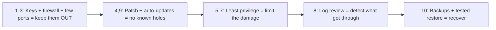

# Security Best Practices

## 1. What Is This?

A practical, beginner-friendly **hardening checklist** for a Linux server, pulling together SSH, firewall, least privilege, updates, and monitoring.

## 2. Why Is This Needed?

Security is a set of habits, not a single action. A checklist ensures you don't forget a critical step when setting up or reviewing a server.

## 3. Simple Layman Explanation

It's a **pre-flight checklist** for your server: tick each item before exposing it to the world, and revisit periodically — like checking locks, alarms, and smoke detectors in a house. Pilots don't skip the checklist because they're experienced; they use it *because* skipping one item is how accidents happen.

## 4. Technical Explanation — The Checklist

| # | Practice | Why |
|---|----------|-----|
| 1 | Use SSH keys; disable password & root login | Stops brute-force |
| 2 | Enable a firewall (default deny) | Shrinks attack surface |
| 3 | Open only needed ports (22/80/443) | Fewer ways in |
| 4 | Keep the system patched | Closes known vulnerabilities |
| 5 | Apply least privilege (no daily root) | Limits blast radius |
| 6 | Run services as non-root users | Contains compromises |
| 7 | Strong, unique passwords; secrets `600` | Prevents easy access |
| 8 | Review auth logs / failed logins | Detect attacks early |
| 9 | Enable automatic security updates | Stay patched effortlessly |
| 10 | Take backups & test restores | Recover from incidents |

## 5. How It Works Under the Hood

This checklist isn't ten random tips — it's the **defense-in-depth model** from [security-basics](security-basics.md) turned into concrete actions, each mapping to a specific attacker step it defeats:

- **Items 1–3 shrink what an attacker can even *reach*.** SSH keys + no root (item 1) close the brute-force door (there's no password to guess — [ssh-basics](ssh-basics.md) §5). The firewall + minimal ports (items 2–3) mean most services aren't reachable at all ([firewall-basics](firewall-basics-ufw-firewalld.md) §5). Together they defeat the *dragnet* — the automated scanning that hits every server. This is the outer wall.
- **Items 4 & 9 close doors attackers already *know about*.** Most breaches exploit *known, patched* vulnerabilities — the victim just hadn't updated. Patching (item 4) and, crucially, *automatic* security updates (item 9) mean the window between "patch released" and "you're protected" shrinks from months to hours. `unattended-upgrades` exists precisely because manual patching always lags. This is the highest-ROI habit on the list.
- **Items 5–7 limit the damage *after* someone gets in.** Least privilege, non-root services, and tight file permissions (Module 04) don't *prevent* a breach — they ensure a breach of the web app is confined to `www-data`, not the whole box ([least-privilege](least-privilege.md) §5). This is the inner wall, sized to the assumption that the outer wall *will* eventually fail somewhere.
- **Item 8 is how you *find out* — the assumption that prevention is imperfect.** Reviewing `auth.log` and watching for failed-login spikes or unexpected sessions is the detection layer. Every other item is prevention or containment; monitoring is the smoke detector that tells you something got through *while you can still act*.
- **Item 10 is what saves you when everything else failed.** Backups (Module 11) are a security control, not just an ops one: ransomware, a destructive attacker, or a compromise you can't fully clean all end the same way — **restore from a known-good backup and rebuild** ([security-basics](security-basics.md) treats breached hosts as disposable). An *untested* backup isn't a control; testing the restore is what makes it real.

Read top to bottom, the checklist is a story: keep them out (1–3), keep the software current (4, 9), shrink the damage if they get in anyway (5–7), notice when they do (8), and recover cleanly (10). No single item is sufficient; the *set* is what makes a server hard to meaningfully hurt.

## 6. Diagram



## 7. Real-World Examples

**1. The everyday case.** A new production server: keys-only SSH, ufw allowing 22/80/443, unattended security upgrades on, Nginx as `www-data`, nightly backups (Module 11), and weekly `auth.log` review. That covers the threats that hit most servers.

**2. Running the checklist and confirming each control:**

```
$ sudo grep -c "Failed password" /var/log/auth.log     # 8: how much attack traffic?
9204
$ sudo ufw status | head -1                            # 2-3: firewall on?
Status: active
$ grep -E '^(PermitRootLogin|PasswordAuthentication)' /etc/ssh/sshd_config    # 1
PermitRootLogin no
PasswordAuthentication no
$ systemctl is-enabled unattended-upgrades             # 9: auto-updates?
enabled
$ ps -eo user,comm | grep nginx                        # 6: services non-root?
root     nginx
www-data nginx
$ crontab -l | grep backup                             # 10: backups scheduled?
0 2 * * * /opt/scripts/backup.sh /var/www /backups >> /var/log/backup.log 2>&1
```

Six commands verified six checklist items are *actually in place* — not assumed. That's the difference between "we hardened it" and "we can prove it's hardened."

**3. War story — hardened everything except updates.** A team did a great job on a server: keys-only SSH, tight firewall, non-root services, backups. Six months later it was breached anyway — through a *known* vulnerability in an outdated library, patched publicly *four months* earlier. They'd never enabled automatic updates, so the one door they left open was the one attackers walk through most (Section 5, item 4/9). The lesson: a checklist with a gap is only as strong as its weakest item, and *un-patched software is the most common gap*. `unattended-upgrades` would have closed it silently.

## 8. Worked Walkthrough

Harden a fresh server end-to-end, safely:

```
$ ssh-copy-id alice@web01 && ssh alice@web01 'echo keys-work'   # 1. keys FIRST, verify
keys-work
$ sudo vi /etc/ssh/sshd_config    # PermitRootLogin no / PasswordAuthentication no
$ sudo sshd -t && sudo systemctl reload ssh                     #    validate then reload
$ sudo ufw allow OpenSSH && sudo ufw default deny incoming \    # 2-3. firewall, SSH allowed first
      && sudo ufw allow 80,443/tcp && sudo ufw enable
Firewall is active and enabled on system startup
$ sudo apt update && sudo apt upgrade -y                        # 4. patch now
$ sudo apt install -y unattended-upgrades \                     # 9. keep it patched
      && sudo dpkg-reconfigure -plow unattended-upgrades
$ sudo grep "Failed password" /var/log/auth.log | tail -2       # 8. baseline the log review
$ crontab -l | grep -q backup && echo "backups scheduled"       # 10. confirm backups exist
backups scheduled
```

Keys before disabling passwords, SSH allowed before enabling the firewall, patch *and* automate patching, then confirm monitoring and backups — the checklist in dependency order, each step verified before the next.

## 9. Commands

```bash
# 1-3 SSH & firewall (see ssh-basics & firewall topics)
sudo ufw default deny incoming && sudo ufw allow 22,80,443/tcp && sudo ufw enable

# 4 & 9 Updates
sudo apt update && sudo apt upgrade -y
sudo apt install -y unattended-upgrades        # auto security updates (Debian/Ubuntu)
sudo dpkg-reconfigure -plow unattended-upgrades

# 5-6 Least privilege
sudo -l ; ps -eo user,comm | sort -u | head

# 8 Monitoring
sudo grep "Failed password" /var/log/auth.log | tail
who ; last | head

# 10 Backups (Module 11)
crontab -l
```

Sample output (dummy values, for reference):

```text
$ systemctl is-enabled unattended-upgrades
enabled

$ sudo ufw status verbose | head -3
Status: active
Default: deny (incoming), allow (outgoing), disabled (routed)
22/tcp                     ALLOW IN    Anywhere

$ sudo grep "Failed password" /var/log/auth.log | tail -1
Jul  2 11:40:05 web01 sshd[22190]: Failed password for invalid user admin from 45.9.1.7 port 40122 ssh2

$ last | head -2
alice    pts/0   203.0.113.9   Wed 11:00   still logged in
reboot   system boot 6.6.0    Wed 06:00
```

## 10. Command Explanation

- `unattended-upgrades` → automatically installs security patches (set-and-forget patching — the highest-ROI item, Section 5).
- The ufw one-liner → applies default-deny + the standard allow list in one go (allow SSH first!).
- `grep "Failed password"` / `last` → routine log review for intrusion signs (the detection layer).
- `sudo -l` / `ps -eo user,comm` → verify least privilege is actually in place (services non-root).
- `crontab -l` → confirm backups are scheduled (the recovery layer).

## 11. In Production (DevOps Context)

- **The checklist is codified, not manual:** Ansible/Terraform apply SSH hardening, firewall rules, unattended-upgrades, and non-root services to every host, and CIS-benchmark scanners (e.g., `lynis`, cloud posture tools) *audit* compliance continuously — drift becomes a ticket, not a surprise.
- **Golden images ship hardened:** the base AMI/container already passes the checklist, so every new instance is secure at boot — hardening is a *build-time* property, not a day-2 scramble (Module 13).
- **Monitoring is centralized and alerting:** `auth.log` and system metrics ship to a SIEM; a failed-login spike or a new listening port pages someone — item 8 at fleet scale.
- **Backups are tested by automation:** restores run on a schedule into a scratch environment, because an untested backup (the recovery layer) is a false sense of security — a classic post-incident finding.

## 12. Practice Tasks

1. Walk the 10-item checklist against a test server; tick what's done and note gaps.
2. Enable automatic security updates and confirm with `systemctl is-enabled unattended-upgrades`.
3. Apply the ufw default-deny + allow list (SSH first!).
4. Review `auth.log` for failed logins, and verify a backup job exists in `crontab -l`.

## 13. Common Mistakes

- Doing some items but skipping updates — the most common breach cause (the war story).
- One-time hardening with no periodic review or audit.
- Forgetting backups are part of security (ransomware/recovery — item 10).
- Assuming a control is in place without *verifying* it (run the checks in §7).

## 14. Troubleshooting

**Locked out after hardening**
- **Cause:** disabled password SSH or enabled the firewall without confirming key access / allowing port 22.
- **Fix:** recover via the cloud console; re-verify SSH and firewall changes in a *second* session next time ([ssh-basics](ssh-basics.md), [firewall-basics](firewall-basics-ufw-firewalld.md)).

**Unattended upgrades broke something**
- **Cause:** auto-applying non-security updates.
- **Fix:** configure it for **security** updates only; test upgrades in staging first (Module 06).

**Unsure of current exposure**
- **Fix:** re-run `ss -ltnp` (what's listening) and `ufw status` (what's allowed) — the two-question attack-surface check ([security-basics](security-basics.md)).

## 15. Best Practices

- Automate what you can (updates, backups, monitoring) — habits that depend on memory fail.
- Review the checklist on every new server and on a schedule; *verify* each control, don't assume it.
- Keep changes reversible; test in a second session; ship hardening as code / in the base image.
- Document your baseline so deviations (drift) are obvious, and test your restores.

## 16. Connects To

- **Prev:** [Least Privilege](least-privilege.md). **Next:** [Module 13 — Real-World Linux for DevOps](../13-real-world-linux-for-devops/README.md).
- **The items in depth:** [Security Basics](security-basics.md), [SSH Basics](ssh-basics.md), [Firewall Basics](firewall-basics-ufw-firewalld.md), [Least Privilege](least-privilege.md).
- **Patching:** [Install/Remove/Update](../06-package-management/install-remove-update-packages.md); **backups:** [Scheduled Backup Example](../11-automation-and-cron/scheduled-backup-example.md); **logs:** [Linux Logs Overview](../09-logs-monitoring-troubleshooting/linux-logs-overview.md).
- **Applied on a real server:** [Production Server Checklist](../13-real-world-linux-for-devops/production-server-checklist.md), [Module 15 Project 04 (Nginx)](../15-mini-projects/project-04-simple-nginx-server-setup.md).

## 17. Quick Recap

- The checklist is defense-in-depth made concrete: keep them out (1–3), stay patched (4, 9), limit the damage (5–7), detect (8), recover (10).
- No single item is enough; a gap (usually **updates**) is where breaches happen — automate patching.
- Verify each control rather than assuming it; test your backups; ship hardening as code.

## 18. References

- CIS Benchmarks: https://www.cisecurity.org/cis-benchmarks
- Ubuntu security guide: https://ubuntu.com/security
- [Module 15 Project 04 (Nginx)](../15-mini-projects/project-04-simple-nginx-server-setup.md)

<!-- NAV-FOOTER -->

---

### 🧭 Navigation

| Previous | Up | Next |
|:---|:---:|---:|
| ⬅️ Prev: [Least Privilege](least-privilege.md) | ⬆️ Module: [Module 12 — Linux Security Basics](README.md) | ➡️ Next: [Module 13 — Real-World Linux for DevOps](../13-real-world-linux-for-devops/README.md) |
