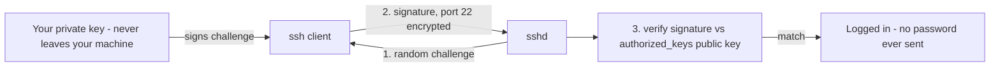

# SSH Basics

## 1. What Is This?

**SSH (Secure Shell)** is the encrypted protocol for logging into and running commands on remote Linux servers. **Key-based authentication** uses a key pair instead of a password.

## 2. Why Is This Needed?

SSH is how you reach almost every cloud/remote server. Doing it securely (keys, no root login) is the single highest-impact security step you can take.

## 3. Simple Layman Explanation

SSH is a **secure phone line** to your server — everything said is scrambled so eavesdroppers learn nothing. A key pair is like a **special lock and key**: the lock (public key) sits on the server; only your private key opens it. You can hand out copies of the *lock* freely, but there's only one *key*, and it never leaves your pocket. Far safer than a guessable password.

## 4. Technical Explanation

- A **key pair**: a **private key** (kept secret on your machine) and a **public key** (placed on the server in `~/.ssh/authorized_keys`).
- The server proves you hold the private key without it ever being sent.
- Server config lives in `/etc/ssh/sshd_config`; hardening disables password login and root login.
- Default port is 22.

## 5. How It Works Under the Hood

The magic of key auth is that **your secret never crosses the wire** — and understanding how makes the security choices obvious:

- **Asymmetric cryptography: the lock and key are mathematically linked but not derivable.** `ssh-keygen` generates a pair where the **public key** can verify a signature that only the matching **private key** could have produced — but you *cannot* work backward from the public key to the private one. So publishing your public key on a thousand servers gives away nothing. This is the opposite of a password, which is a shared secret both sides must know (and which can be stolen from *either* side).
- **The challenge–response handshake — why the private key is never sent.** When you connect, the server (having your public key in `authorized_keys`) sends a random **challenge**. Your client **signs** it with your private key and sends back the signature. The server verifies the signature against your public key. If it checks out, you're in — and your private key **never left your machine**. A network eavesdropper sees only a random challenge and a one-time signature, useless for impersonation. That's why brute-forcing SSH keys is infeasible: there's no password to guess, and the key itself is never exposed.
- **Why passwords are the weak link.** A password is guessable (bots try millions) and *transmitted* (verified server-side each login). Disabling `PasswordAuthentication` removes the entire brute-force attack surface from Section 5's dragnet — the bots can knock forever and never succeed, because there's no password to guess. This one change is why `auth.log` goes quiet.
- **Why `chmod 600` on the private key is enforced by SSH itself.** SSH **refuses** to use a private key that other users can read (`Permissions 0644 ... are too open`). The reasoning: on a shared machine, a world-readable private key could be copied by any other user, defeating the whole scheme. The key is only as secret as its file permissions (Module 04) — so SSH treats loose permissions as a hard error, not a warning.
- **Why disabling root login matters.** `root` is a *known* username on every Linux box, so it's the #1 brute-force target. `PermitRootLogin no` forces attackers to guess a valid *username* too, and pushes admins toward the safer pattern of logging in as a normal user and escalating with `sudo` (Module 04) — which also leaves an audit trail of who did what.

So SSH's security rests on math (you can't derive the private key), protocol (the secret is never sent), and file permissions (the key stays secret locally) — three independent guarantees, matching the defense-in-depth idea from [security-basics](security-basics.md).

## 6. Diagram



## 7. Real-World Examples

**1. The everyday case.** You generate a key pair, copy the public key to a new EC2 instance, and from then on `ssh ubuntu@server` logs in instantly and securely — no password, immune to brute-force.

**2. Generating a key and connecting:**

```
$ ssh-keygen -t ed25519 -C "alice@laptop"
Generating public/private ed25519 key pair.
Enter file in which to save the key (/home/alice/.ssh/id_ed25519):
Enter passphrase (empty for no passphrase): ********
Your identification has been saved in /home/alice/.ssh/id_ed25519
Your public key has been saved in /home/alice/.ssh/id_ed25519.pub
$ ssh-copy-id alice@web01              # install the PUBLIC key on the server
Number of key(s) added: 1
$ ssh alice@web01                       # now logs in with the key, no password
Welcome to Ubuntu 22.04.3 LTS
alice@web01:~$
```

Only the `.pub` (public) key was copied to the server; the private key stayed on the laptop — exactly the Section 5 model.

**3. War story — the locked-out engineer.** An engineer hardening a server set `PasswordAuthentication no` and reloaded sshd — *before* confirming their key actually worked. Their public key had a typo in `authorized_keys`, so key auth failed, and now password auth was off too: **total lockout**. They had to recover through the cloud provider's serial console. The fix (and the rule from Section 5 / defense-in-depth): **keep a second SSH session open** while changing sshd config, and verify key login in that spare session *before* disabling passwords. If the new setting locks you out, the old session is still alive to undo it.

## 8. Worked Walkthrough

Set up keys and harden safely, without risking lockout:

```
$ ssh-keygen -t ed25519 -C "alice@laptop"     # 1. make a key pair (add a passphrase)
$ ssh-copy-id alice@web01                       # 2. push the PUBLIC key to the server
$ ssh alice@web01 'echo key-login-works'        # 3. PROVE key login works first
key-login-works
$ ssh alice@web01                               # 4. open session #1 and KEEP IT OPEN
alice@web01:~$ sudo vi /etc/ssh/sshd_config     #    set: PermitRootLogin no
alice@web01:~$                                  #         PasswordAuthentication no
alice@web01:~$ sudo sshd -t && sudo systemctl reload ssh   # 5. test config THEN reload
# 6. in a SECOND terminal, verify you can still get in before closing session #1:
$ ssh alice@web01 'echo still-in'
still-in                                         # safe — now the change is trusted
```

The ordering is the whole point: prove key login, hold a live session, test the config (`sshd -t`), reload, and re-verify in a fresh session before letting go — the anti-lockout discipline from the war story.

## 9. Commands

```bash
ssh-keygen -t ed25519 -C "you@example.com"   # generate a modern key pair
ls ~/.ssh                                     # id_ed25519 (private), id_ed25519.pub (public)
ssh-copy-id user@server                       # install your public key on the server
ssh user@server                               # connect
ssh -i ~/.ssh/id_ed25519 user@server          # specify a key explicitly
ssh -p 2222 user@server                       # non-default port
chmod 600 ~/.ssh/id_ed25519                   # private key must be owner-only
sudo sshd -t                                  # test sshd_config for errors BEFORE reload
sudo systemctl reload ssh                     # apply sshd config changes
```

Hardening in `/etc/ssh/sshd_config`:

```
PermitRootLogin no
PasswordAuthentication no
```

Sample output (dummy values, for reference):

```text
$ ls -l ~/.ssh
-rw------- 1 alice alice  411 Jul  2 10:00 id_ed25519       # 600 - private, owner-only
-rw-r--r-- 1 alice alice  102 Jul  2 10:00 id_ed25519.pub   # 644 - public, shareable

$ ssh alice@web01
Welcome to Ubuntu 22.04.3 LTS
Last login: Wed Jul  2 09:15:02 2026 from 203.0.113.9

$ sudo sshd -t
$                                # no output = config is valid (reload is safe)

$ ssh -i ~/.ssh/id_ed25519 alice@web01 'whoami'
alice
```

## 10. Command Explanation

- `ssh-keygen -t ed25519` → creates a strong, modern key pair; **add a passphrase** when prompted (protects the key if the file is stolen).
- `ssh-copy-id` → appends your **public** key to the server's `authorized_keys` (only the public half leaves your machine — Section 5).
- `ssh -i <key>` → choose which private key to use.
- `chmod 600` on the private key → SSH **refuses** keys that are too open (Section 5).
- `sshd -t` → validates the config file; catches typos *before* a reload that could lock you out.
- Editing `sshd_config` then `systemctl reload ssh` → disables root and password login (**keep a working session open** while testing!).

## 11. In Production (DevOps Context)

- **Keys are provisioned automatically:** cloud instances get your public key injected at launch (AWS key pairs, `cloud-init`), so key-only access is the default from boot — no password ever set (Module 13).
- **No shared keys — per-person or per-service:** each engineer has their own key (easy to revoke one person), and automation uses dedicated **deploy keys** / short-lived certificates. Revoking access = removing one line from `authorized_keys`.
- **Bastion / jump hosts:** production servers often accept SSH *only* from a hardened bastion (and only from known IPs), so the fleet isn't directly exposed — layering with the firewall (next topic).
- **SSH config as code:** `sshd_config` hardening (`PermitRootLogin no`, `PasswordAuthentication no`) ships via Ansible/Terraform, and `sshd -t` runs in CI so a bad config never reaches a box.

## 12. Practice Tasks

1. Generate a key pair with `ssh-keygen -t ed25519` (use a passphrase).
2. Inspect `~/.ssh`; identify the public vs private key and confirm their permissions (`600` vs `644`).
3. (On a test server) `ssh-copy-id` and log in without a password.
4. Run `sudo sshd -t` after editing the config, and practice the "keep a second session open" habit before reloading.

## 13. Common Mistakes

- Sharing or committing the **private** key (never — only the `.pub` is shared; Section 5).
- Disabling password auth **before** confirming key login works → lockout (the war story).
- Loose private key permissions → "UNPROTECTED PRIVATE KEY" error (`chmod 600`).
- Reloading sshd without `sshd -t` first, so a typo takes effect and locks you out.

## 14. Troubleshooting

**Permission denied (publickey)**
- **Causes:** wrong key/user, or public key not in the server's `authorized_keys`.
- **Check/Fix:** `ssh -v user@server` to see which keys are offered; confirm the `.pub` line is present in `~/.ssh/authorized_keys` on the server and that `~/.ssh` is `700`.

**"UNPROTECTED PRIVATE KEY FILE"**
- **Cause:** the private key is group/world-readable.
- **Fix:** `chmod 600 ~/.ssh/id_ed25519` (SSH enforces this — Section 5).

**Connection refused vs timed out**
- **Refused:** sshd isn't running or nothing listens on the port → `systemctl status ssh`.
- **Timed out:** a firewall / cloud security group blocks the port, or wrong IP → check both layers (next topic).

## 15. Best Practices

- Use key-based auth; disable password and root login (`PermitRootLogin no`, `PasswordAuthentication no`).
- Protect private keys with a passphrase; never share or commit them.
- Restrict SSH to known IPs in the firewall/security group; consider a bastion host.
- Keep a second active session open and run `sshd -t` when changing sshd config.

## 16. Connects To

- **Prev:** [Security Basics](security-basics.md). **Next:** [Firewall Basics (ufw / firewalld)](firewall-basics-ufw-firewalld.md).
- **Key file permissions:** [File Permissions](../04-users-groups-permissions/file-permissions.md), [chmod/chown/chgrp](../04-users-groups-permissions/chmod-chown-chgrp.md).
- **Restricting the port:** [Firewall Basics](firewall-basics-ufw-firewalld.md), [Ports & Sockets](../07-networking-basics/ports-and-sockets.md).
- **Reaching cloud servers:** [Cloud Linux Server](../01-linux-setup/cloud-linux-server.md); **the sshd service:** [systemd Services](../05-processes-and-services/systemd-services.md).

## 17. Quick Recap

- SSH = encrypted remote access; keys beat passwords because the secret is **never sent** and can't be brute-forced.
- Public key on server (`authorized_keys`), private key stays with you (`chmod 600`, passphrase).
- Harden: `PermitRootLogin no`, `PasswordAuthentication no` — but verify key login and keep a second session open first (`sshd -t` before reload).

## 18. References

- OpenSSH: https://www.openssh.com/manual.html
- `man ssh`, `man ssh-keygen`, `man sshd_config`

<!-- NAV-FOOTER -->

---

### 🧭 Navigation

| Previous | Up | Next |
|:---|:---:|---:|
| ⬅️ Prev: [Security Basics](security-basics.md) | ⬆️ Module: [Module 12 — Linux Security Basics](README.md) | ➡️ Next: [Firewall Basics (ufw / firewalld)](firewall-basics-ufw-firewalld.md) |
