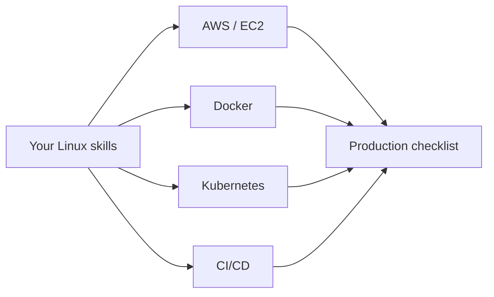

# Module 13 — Real-World Linux for DevOps

## What You Will Learn

- How Linux underpins AWS, Docker, Kubernetes, and CI/CD.
- The Linux skills that matter most in each.
- A production-server readiness checklist.

## Why This Module Matters

This module connects everything you've learned to the tools DevOps engineers use daily. Linux isn't a separate subject — it's the ground Docker, Kubernetes, and the cloud stand on.

## Real-World Use Case

You'll see exactly how `systemctl`, `ss`, `journalctl`, permissions, and scripting show up when operating EC2 instances, containers, Kubernetes nodes, and pipelines.

## Topics Covered

| File | What It Covers |
|------|----------------|
| [linux-for-aws.md](./linux-for-aws.md) | EC2, SSH, cloud-init, IAM context |
| [linux-for-docker.md](./linux-for-docker.md) | Containers as Linux processes |
| [linux-for-kubernetes.md](./linux-for-kubernetes.md) | Nodes, pods, debugging |
| [linux-for-ci-cd.md](./linux-for-ci-cd.md) | Runners, pipelines, shell |
| [production-server-checklist.md](./production-server-checklist.md) | Go-live readiness |

## Learning Flow

## Hands-On Practice

If you have the tools: launch an EC2 instance, run a container, inspect a node, and read a simple pipeline file — mapping each to Linux concepts you know.

## Common Mistakes

- Treating Docker/K8s as "magic" rather than Linux primitives.
- Ignoring logs/resources because it's "in the cloud."

## Troubleshooting

- Container won't start → it's a Linux process; check logs, exit code, permissions, ports.
- Node issues → SSH in and use the same Linux tools from earlier modules.

## Best Practices

- Apply the same Linux fundamentals everywhere — they don't change in the cloud.
- Use the production checklist before going live.

## Quick Revision

- Cloud/containers/orchestration are Linux underneath.
- Your file, process, network, log, and scripting skills transfer directly.

## Next Module

➡️ [14 — Hands-On Labs](../14-hands-on-labs/).

<!-- NAV-FOOTER -->

---

### 🧭 Navigation

| Previous | Up | Next |
|:---|:---:|---:|
| ⬅️ Prev: [Security Best Practices](../12-linux-security-basics/security-best-practices.md) | ⬆️ Home: [Learning Linux](../README.md) | ➡️ Next: [Linux for AWS](linux-for-aws.md) |
