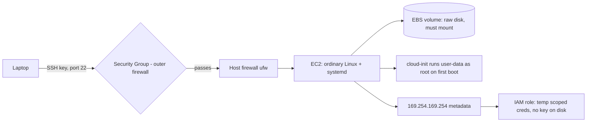

# Linux for AWS

## 1. What Is This?

How your Linux skills apply to **AWS**, especially **EC2** (virtual servers). EC2 instances are Linux machines you operate with the exact commands from earlier modules.

## 2. Why Is This Needed?

Most cloud workloads run on Linux EC2 instances. Operating them — SSH, services, logs, disks, networking — is pure Linux. AWS adds a thin layer (security groups, IAM, cloud-init) on top.

## 3. Simple Layman Explanation

EC2 is **renting a Linux computer in Amazon's data center**. Once you SSH in, it's the same Ubuntu/RHEL you've been practicing on — just reached over the internet. AWS is mostly the *building and utilities* around the computer: the locked door (security group), the ID badge (IAM role), the setup crew that preps the desk before you arrive (cloud-init).

## 4. Technical Explanation

AWS-specific Linux touchpoints:
- **SSH** with a key pair to the instance's public IP (Module 12).
- **Security groups** = a cloud firewall in front of the host firewall (Module 7/12).
- **cloud-init / user-data** runs a script on first boot to configure the instance.
- **EBS volumes** = disks you partition, format, and mount (Module 8).
- **IAM roles** give the instance permissions to other AWS services (no keys on disk).
- Instance metadata at `http://169.254.169.254/latest/meta-data/`.

## 5. How It Works Under the Hood

The key insight is that **AWS doesn't replace Linux — it wraps a thin cloud layer around an ordinary Linux box**, and every "AWS problem" is really a Linux concept plus one AWS wrapper:

- **An EC2 instance boots a normal Linux kernel; the "cloud" is what's around it.** When you launch an instance, AWS boots a stock Ubuntu/Amazon Linux image on a virtualized machine. Once it's up, `uname`, `systemd`, `/var/log`, `ps`, `mount` — all identical to a laptop VM. The AWS-specific parts (metadata, IAM, EBS, security groups) sit *at the edges*: at boot, on the network, on attached disks, and on the API for other services. Debugging "the server" is 90% ordinary Linux (Modules 05, 08, 09) and 10% "which AWS wrapper is in the way?"
- **Two firewalls in series — security group first.** From [firewall-basics](../12-linux-security-basics/firewall-basics-ufw-firewalld.md) §5: a packet to your instance passes the **security group** (outside the VM, in AWS's network) *before* it ever reaches the host firewall (ufw) or the listening service. This ordering is why "the service is running, ufw allows it, but it's unreachable" is almost always the security group — the outer gate dropped it. The instance's own OS never saw the packet. Always check the security group *first* for connectivity issues.
- **cloud-init runs your setup script as root on first boot.** The **user-data** you provide is executed *once*, at initial boot, by the `cloud-init` service — as root, before you ever log in. That's how an instance can install Nginx and configure itself with zero manual steps. When first-boot setup "didn't work," the evidence is in `journalctl -u cloud-init` and `/var/log/cloud-init-output.log` (Module 09) — it's just a systemd service running a script, debuggable like any other.
- **EBS volumes are raw disks — the block-device model from Module 08, unchanged.** Attaching an EBS volume makes a new block device appear (`/dev/xvdf` or `/dev/nvme1n1`) exactly like plugging in a physical disk. It has **no filesystem** until you make one (`mkfs`), and it does nothing until you `mount` it — the identical partition → format → mount → `/etc/fstab` flow from [mount-and-umount](../08-storage-and-disk-management/mount-and-umount.md). "The 100 GB volume isn't there" almost always means "attached but not mounted" — `lsblk` shows it waiting.
- **IAM roles = credentials with no secret on disk.** Instead of copying AWS access keys onto the box (which leak), you attach an **IAM role**; the instance fetches *temporary, auto-rotating* credentials from the metadata endpoint (`169.254.169.254`), and the SDK/CLI uses them transparently. This is [least-privilege](../12-linux-security-basics/least-privilege.md) applied to cloud APIs: the role grants a scoped set of permissions ("read this bucket"), and there's no long-lived secret to steal. The metadata endpoint is a link-local address reachable *only from inside* the instance.

So operating EC2 is your existing Linux toolkit — SSH, systemd, mount, logs, permissions — plus knowing which thin AWS wrapper (security group, cloud-init, EBS attach, IAM) to look at when the Linux layer alone doesn't explain what you see.

## 6. Diagram



## 7. Real-World Examples

**1. The everyday case.** You launch an Ubuntu EC2 instance with user-data that installs Nginx on boot. You SSH in, check `systemctl status nginx`, open port 80 in the security group, attach and mount an EBS data volume — every step is a skill from Modules 1, 5, 8, and 12.

**2. Landing on a fresh instance and inspecting it:**

```
$ ssh -i key.pem ubuntu@203.0.113.50
Welcome to Ubuntu 22.04.3 LTS
$ uname -r ; whoami                       # it's just Linux
6.5.0-1018-aws
ubuntu
$ lsblk                                    # the attached EBS data volume...
NAME    MAJ:MIN RM SIZE RO TYPE MOUNTPOINT
xvda    202:0    0   8G  0 disk
└─xvda1 202:1    0   8G  0 part /          # root volume
xvdf    202:80   0 100G  0 disk            # ...100G attached but NO mountpoint yet!
$ curl -s http://169.254.169.254/latest/meta-data/iam/security-credentials/
web-instance-role                          # the IAM role providing temp creds
```

`xvdf` is attached but unmounted (the Section 5 EBS trap), and the metadata endpoint confirms the IAM role — pure Linux plus two AWS wrappers.

**3. War story — "port 80 is open but the site won't load."** A team launched a web server, confirmed `systemctl status nginx` was active and `curl localhost` worked *on the box*, opened port 80 in ufw, and still got timeouts from their browser. Twenty minutes of host-side debugging found nothing — because the block was the **security group**, which only allowed port 22, not 80 (Section 5's two-firewalls rule). The packet was dropped by AWS's outer gate before reaching the instance. Adding an inbound HTTP rule to the security group fixed it instantly. Lesson: on EC2, a *timeout* from outside means check the **security group first**, then ufw, then the service — outer gate to inner.

## 8. Worked Walkthrough

Attach and mount a new EBS volume — the Module 08 flow on AWS:

```
$ lsblk                                    # 1. find the new device (no mountpoint)
xvdf    202:80   0 100G  0 disk
$ sudo file -s /dev/xvdf                    # 2. is there a filesystem yet?
/dev/xvdf: data                             #    "data" = EMPTY, needs formatting
$ sudo mkfs.ext4 /dev/xvdf                   # 3. create a filesystem (fresh volumes ONLY)
$ sudo mkdir -p /data && sudo mount /dev/xvdf /data   # 4. mount it
$ df -h /data                                # 5. confirm it's usable
Filesystem      Size  Used Avail Use% Mounted on
/dev/xvdf        98G   24K   93G   1% /data
$ echo '/dev/xvdf /data ext4 defaults,nofail 0 2' | sudo tee -a /etc/fstab   # 6. persist across reboots
```

Identical to [mount-and-umount](../08-storage-and-disk-management/mount-and-umount.md): find the device, check/create a filesystem, mount, then `/etc/fstab` for persistence (`nofail` so a missing volume doesn't block boot). AWS only *provided* the disk.

## 9. Commands

```bash
ssh -i key.pem ubuntu@<public-ip>           # connect (Module 12)
systemctl status nginx                       # manage services (Module 5)
ss -ltnp                                      # check listeners (Module 7)
lsblk ; sudo mount /dev/xvdf /data           # attach EBS storage (Module 8)
journalctl -u cloud-init                      # debug boot-time setup
curl http://169.254.169.254/latest/meta-data/  # instance metadata
df -h ; free -h ; top                         # health (Module 9)
```

Sample output (dummy values, for reference):

```text
$ curl -s http://169.254.169.254/latest/meta-data/instance-id
i-0abc123def4567890

$ journalctl -u cloud-init --no-pager | tail -3
Jul 02 06:00:12 web01 cloud-init[812]: Cloud-init v. 23.1 running 'modules:final'
Jul 02 06:00:19 web01 cloud-init[812]: Installed: nginx
Jul 02 06:00:19 web01 cloud-init[812]: Cloud-init v. 23.1 finished

$ lsblk
NAME    MAJ:MIN RM SIZE RO TYPE MOUNTPOINT
xvda    202:0    0   8G  0 disk
└─xvda1 202:1    0   8G  0 part /
xvdf    202:80   0 100G  0 disk /data
```

## 10. Command Explanation

- `ssh -i key.pem ubuntu@ip` → standard EC2 login (user is often `ubuntu` or `ec2-user`; key auth from Module 12).
- `journalctl -u cloud-init` → see what the first-boot script did and any errors (it's just a systemd service — Section 5).
- `lsblk` + `mount` → make an attached EBS volume usable (raw disk → filesystem → mount, Section 5).
- `curl .../meta-data/` → query instance metadata (instance ID, IAM role) from the link-local endpoint.
- Everything else is the same Linux tooling you already know (Modules 05/07/09).

## 11. In Production (DevOps Context)

- **Instances are cattle, not pets:** they're launched from a golden AMI via Terraform/Auto Scaling, configured by user-data, and *replaced* rather than patched in place — which is why treating a compromised or broken box as disposable ([security-basics](../12-linux-security-basics/security-basics.md)) fits the cloud model perfectly.
- **Security groups and IAM are managed as code:** exposure (which ports, from where) and permissions (what the instance can call) live in version control, reviewed like any change — no click-ops drift.
- **IAM roles everywhere, static keys nowhere:** production instances carry scoped roles so a compromised box leaks only temporary, narrow credentials — least privilege for the cloud API surface (Module 12).
- **Observability leaves the box:** the CloudWatch agent ships `/var/log`, metrics, and journald so you diagnose an instance *without* SSHing in — and often before it's replaced. Your Linux log/metric knowledge (Module 09) is exactly what those dashboards show.

## 12. Practice Tasks

1. Launch a free-tier Ubuntu EC2 instance and SSH in with `ssh -i key.pem`.
2. `df -h`, `free -h`, `lsblk` to inspect it — note any attached-but-unmounted volume.
3. Read instance metadata and the IAM role via the `curl` commands.
4. Install Nginx and open port 80 **in the security group**; verify with `curl` from your laptop (not just localhost).
5. **Terminate** the instance when done (avoid cost).

## 13. Common Mistakes

- Forgetting the security group is a separate, *outer* firewall from the host firewall — both must allow traffic (the war story).
- Assuming an attached EBS volume is ready — it's a raw disk until formatted and mounted (Section 5).
- Putting AWS access keys on disk instead of using IAM roles (least privilege — Module 12).
- Leaving instances running and incurring cost.

## 14. Troubleshooting

**Can't SSH in**
- **Causes:** security group doesn't allow port 22 from your IP, wrong key/user (`ubuntu` vs `ec2-user`), or the instance is still booting.
- **Check:** security group inbound rules first, then `ssh -v -i key.pem user@ip`.

**App unreachable from the internet (but `curl localhost` works on the box)**
- **Cause:** the *timeout* points at a firewall drop — usually the **security group**, then host ufw (the war story; [firewall-basics](../12-linux-security-basics/firewall-basics-ufw-firewalld.md)).
- **Check:** security group → ufw → the service, outer to inner.

**EBS volume not visible / "disk full but I added a volume"**
- **Cause:** attached but not mounted, or mounted somewhere you didn't expect.
- **Fix:** `lsblk` to find it, then format (if new) and `mount` — persist in `/etc/fstab` with `nofail` (Section 5 / Module 08).

**First-boot setup didn't run**
- **Fix:** `journalctl -u cloud-init` and `/var/log/cloud-init-output.log` show what user-data did and any errors (Module 09).

## 15. Best Practices

- Use IAM roles, not static keys, on instances; scope them to least privilege.
- Restrict SSH to your IP in the security group; open only needed ports; align with host ufw.
- Tag and stop/terminate unused instances; set billing alerts.
- Automate setup with user-data/cloud-init; persist volumes in `/etc/fstab` with `nofail`; ship logs/metrics off-box.

## 16. Connects To

- **Prev:** [Module 13 — Real-World Linux for DevOps](README.md). **Next:** [Linux for Docker](linux-for-docker.md).
- **Reaching the box:** [SSH Basics](../12-linux-security-basics/ssh-basics.md), [Cloud Linux Server](../01-linux-setup/cloud-linux-server.md).
- **The two firewalls:** [Firewall Basics](../12-linux-security-basics/firewall-basics-ufw-firewalld.md), [Ports & Sockets](../07-networking-basics/ports-and-sockets.md).
- **EBS = block devices:** [Mount & Umount](../08-storage-and-disk-management/mount-and-umount.md), [df/du/lsblk](../08-storage-and-disk-management/df-du-lsblk.md); **boot logs:** [journalctl Basics](../09-logs-monitoring-troubleshooting/journalctl-basics.md); **IAM = least privilege:** [Least Privilege](../12-linux-security-basics/least-privilege.md).

## 17. Quick Recap

- EC2 is an ordinary Linux server reached over SSH; every prior module applies directly.
- AWS wraps a thin layer around it: security groups (outer firewall), cloud-init (first-boot script), EBS (raw disks to mount), IAM roles (scoped creds, no key on disk).
- Debug outer-to-inner: security group → host firewall → service; check `lsblk` for unmounted volumes and `journalctl -u cloud-init` for boot setup.

## 18. References

- AWS EC2 docs: https://docs.aws.amazon.com/ec2/
- cloud-init: https://cloudinit.readthedocs.io/

<!-- NAV-FOOTER -->

---

### 🧭 Navigation

| Previous | Up | Next |
|:---|:---:|---:|
| ⬅️ Prev: [Module 13 — Real-World Linux for DevOps](README.md) | ⬆️ Module: [Module 13 — Real-World Linux for DevOps](README.md) | ➡️ Next: [Linux for Docker](linux-for-docker.md) |
