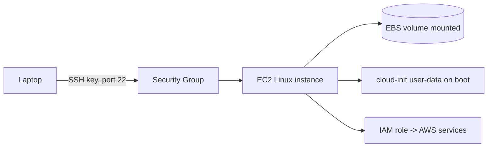

# Linux for AWS

## 1. What Is This?

How your Linux skills apply to **AWS**, especially **EC2** (virtual servers). EC2 instances are Linux machines you operate with the exact commands from earlier modules.

## 2. Why Is This Needed?

Most cloud workloads run on Linux EC2 instances. Operating them — SSH, services, logs, disks, networking — is pure Linux. AWS adds a thin layer (security groups, IAM, cloud-init) on top.

## 3. Simple Layman Explanation

EC2 is **renting a Linux computer in Amazon's data center**. Once you SSH in, it's the same Ubuntu/RHEL you've been practicing on — just reached over the internet.

## 4. Technical Explanation

AWS-specific Linux touchpoints:
- **SSH** with a key pair to the instance's public IP (Module 12).
- **Security groups** = a cloud firewall in front of the host firewall (Module 7/12).
- **cloud-init / user-data** runs a script on first boot to configure the instance.
- **EBS volumes** = disks you partition, format, and mount (Module 8).
- **IAM roles** give the instance permissions to other AWS services (no keys on disk).
- Instance metadata at `http://169.254.169.254/latest/meta-data/`.

## 5. Real-World Example

You launch an Ubuntu EC2 instance with user-data that installs Nginx on boot. You SSH in, check `systemctl status nginx`, open port 80 in the security group, attach and mount an EBS data volume — every step is a skill from Modules 1, 5, 8, and 12.

## 6. Diagram



## 7. Commands

```bash
ssh -i key.pem ubuntu@<public-ip>           # connect (Module 12)
systemctl status nginx                       # manage services (Module 5)
ss -ltnp                                      # check listeners (Module 7)
lsblk ; sudo mount /dev/xvdf /data           # attach EBS storage (Module 8)
journalctl -u cloud-init                      # debug boot-time setup
curl http://169.254.169.254/latest/meta-data/  # instance metadata
df -h ; free -h ; top                         # health (Module 9)
```

## 8. Command Explanation

- `ssh -i key.pem ubuntu@ip` → standard EC2 login (user is often `ubuntu` or `ec2-user`).
- `journalctl -u cloud-init` → see what the first-boot script did and any errors.
- `lsblk` + `mount` → make an attached EBS volume usable.
- `curl .../meta-data/` → query instance metadata (instance ID, IAM role, etc.).
- Everything else is the same Linux tooling you already know.

## 9. Practice Tasks

1. Launch a free-tier Ubuntu EC2 instance and SSH in.
2. `df -h`, `free -h`, `lsblk` to inspect it.
3. Read instance metadata via the `curl` command.
4. Install Nginx and open port 80 in the security group; verify with `curl`.
5. **Terminate** the instance when done.

## 10. Common Mistakes

- Forgetting the security group is separate from the host firewall (both must allow traffic).
- Leaving instances running and incurring cost.
- Putting AWS access keys on disk instead of using IAM roles.

## 11. Troubleshooting

- **Can't SSH** → security group (port 22), wrong key/user, or instance still booting.
- **App unreachable** → security group + host firewall + the service itself; check all three.
- **EBS volume not visible** → `lsblk`; it may need mounting (Module 8).

## 12. Best Practices

- Use IAM roles, not static keys, on instances.
- Restrict SSH to your IP; open only needed ports.
- Tag and stop/terminate unused instances; set billing alerts.
- Automate setup with user-data/cloud-init.

## 13. Quick Recap

- EC2 = a Linux server reached over SSH; all prior modules apply.
- AWS adds security groups, IAM roles, cloud-init, and EBS.
- Debug with the same Linux tools.

## 14. References

- AWS EC2 docs: https://docs.aws.amazon.com/ec2/
- cloud-init: https://cloudinit.readthedocs.io/

<!-- NAV-FOOTER -->

---

### 🧭 Navigation

| Previous | Up | Next |
|:---|:---:|---:|
| ⬅️ Prev: [Module 13 — Real-World Linux for DevOps](README.md) | ⬆️ Module: [Module 13 — Real-World Linux for DevOps](README.md) | ➡️ Next: [Linux for Docker](linux-for-docker.md) |
