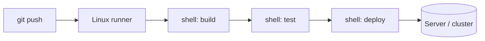

# Linux for CI/CD

## 1. What Is This?

How **CI/CD** (Continuous Integration / Continuous Delivery) pipelines run on Linux. Build/test/deploy steps are usually **shell commands executed on Linux runners**.

## 2. Why Is This Needed?

Pipelines (GitHub Actions, GitLab CI, Jenkins) automate building and shipping software. Most pipeline steps are Linux shell scripts — your scripting, permissions, and troubleshooting skills are exactly what's needed to write and fix them.

## 3. Simple Layman Explanation

CI/CD is an **assembly line** for code: every time you push, a fresh Linux worker checks out the code, builds it, tests it, and deploys it — running shell commands you'd otherwise type by hand.

## 4. Technical Explanation

- A **runner/agent** is a Linux machine (often a container) that executes pipeline jobs.
- Each job runs **shell steps** (`run: ...`) in bash.
- Pipelines use the same Linux concepts: environment variables, exit codes (`$?`), permissions (`chmod +x`), packages (apt), and artifacts (files).
- A failing step is a non-zero exit code — debugged like any script (Module 10).

## 5. Real-World Example

On push, GitHub Actions spins up an Ubuntu runner that runs `npm ci`, `npm test`, builds a Docker image, and deploys. If a step exits non-zero, the pipeline fails — and the fix is reading the log and the shell command, just like debugging a script.

## 6. Diagram



## 7. Commands / Example

A minimal GitHub Actions workflow (`.github/workflows/ci.yml`):

```yaml
name: CI
on: [push]
jobs:
  build:
    runs-on: ubuntu-latest          # a Linux runner
    steps:
      - uses: actions/checkout@v4
      - name: Show environment       # plain Linux commands
        run: |
          uname -a
          whoami
          pwd
      - name: Install & test
        run: |
          chmod +x ./scripts/test.sh   # permissions (Module 4/10)
          ./scripts/test.sh            # exit code decides pass/fail
```

Useful locally to mimic a runner step:

```bash
set -euo pipefail        # the safe header CI relies on
./scripts/build.sh ; echo "exit: $?"
```

## 8. Command Explanation

- `runs-on: ubuntu-latest` → the job executes on a Linux VM.
- `run: |` blocks → multi-line **bash**; each line is a shell command.
- `chmod +x` + `./scripts/test.sh` → exactly the Module 10 workflow.
- A non-zero exit code from any step **fails the job** — which is why `set -euo pipefail` matters.
- `$?` → the exit code; CI uses it to decide success/failure.

## 9. Practice Tasks

1. Write a tiny `scripts/test.sh` that exits 0, then 1, and predict CI pass/fail.
2. Add a `run:` step that prints `uname -a`, `whoami`, `pwd`.
3. Locally run a script with `set -euo pipefail` and check `$?`.
4. Read a real pipeline file in any open-source repo and identify the shell steps.

## 10. Common Mistakes

- Assuming the runner has your local tools/PATH — it's a clean Linux environment (like cron!).
- Scripts not executable (`chmod +x`) or with CRLF line endings.
- Ignoring exit codes, so failures pass silently.

## 11. Troubleshooting

- **Step fails** → read the log; it's a shell command with a non-zero exit. Reproduce locally.
- **"command not found" in CI** → install it in a step (apt) or use a runner image that has it.
- **Permission/format errors** → `chmod +x`, fix line endings (`dos2unix`).

## 12. Best Practices

- Use `set -euo pipefail` in pipeline scripts.
- Pin tool versions; install what you need explicitly.
- Keep secrets in the CI secret store, not in the repo.
- Make steps idempotent and reproducible locally.

## 13. Quick Recap

- CI/CD runs shell steps on Linux runners.
- Exit codes decide pass/fail; debug like any script.
- Same skills: scripting, permissions, packages, environment.

## 14. References

- GitHub Actions: https://docs.github.com/actions
- GitLab CI: https://docs.gitlab.com/ee/ci/
