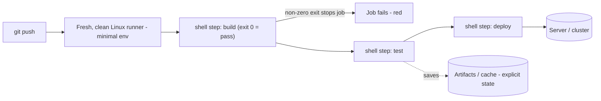

# Linux for CI/CD

## 1. What Is This?

How **CI/CD** (Continuous Integration / Continuous Delivery) pipelines run on Linux. Build/test/deploy steps are usually **shell commands executed on Linux runners**.

## 2. Why Is This Needed?

Pipelines (GitHub Actions, GitLab CI, Jenkins) automate building and shipping software. Most pipeline steps are Linux shell scripts — your scripting, permissions, and troubleshooting skills are exactly what's needed to write and fix them.

## 3. Simple Layman Explanation

CI/CD is an **assembly line** for code: every time you push, a fresh Linux worker checks out the code, builds it, tests it, and deploys it — running shell commands you'd otherwise type by hand. And because every product starts on a *brand-new, empty* workbench, nothing from your last build (or your laptop) is lying around to help — the line has to bring its own tools each time.

## 4. Technical Explanation

- A **runner/agent** is a Linux machine (often a container) that executes pipeline jobs.
- Each job runs **shell steps** (`run: ...`) in bash.
- Pipelines use the same Linux concepts: environment variables, exit codes (`$?`), permissions (`chmod +x`), packages (apt), and artifacts (files).
- A failing step is a non-zero exit code — debugged like any script (Module 10).

## 5. How It Works Under the Hood

The mental model that makes CI "click": **a runner is a fresh, throwaway Linux box (usually a container) that runs your shell commands and judges each one by its exit code.** Every CI concept follows from those two facts:

- **Exit codes are the entire pass/fail mechanism.** After each step, the runner checks `$?` (the exit status from Module 10): **0 = success, non-zero = failure**. A non-zero exit **stops the job** and marks it red. This is why `set -euo pipefail` matters so much in CI: without `-e`, a script keeps going after a failed command and can exit 0 despite a broken build ("green but wrong"); with it, the first failure aborts and the exit code is honest. CI didn't invent this — it's the shell's exit-status convention (Module 10) wired to a red/green light.
- **The runner is clean and ephemeral — like cron, but more so.** Each job starts from a *fresh* image with a **minimal, defined environment**: only the tools the image ships with, a set PATH, none of your laptop's installed packages or shell customizations, and an empty working directory until `checkout` runs. This is the *exact same class of surprise* as cron's minimal environment ([what-is-cron](../11-automation-and-cron/what-is-cron.md) §5): "works on my machine, fails in CI" is almost always a tool or env var that exists locally but not on the clean runner. The fix is the same discipline — install what you need explicitly, don't assume ambient tools.
- **Every step is literally a shell running your commands.** `run: |` blocks are multi-line **bash**. `npm ci`, `chmod +x ./test.sh`, `./test.sh`, `docker build` — these are the same commands you'd type, executed by `/bin/bash` on the runner. So debugging a failed pipeline is debugging a shell script (Module 10): read the log, find the command that exited non-zero, reproduce it locally in a clean environment.
- **State doesn't persist between jobs unless you *make* it.** Because the runner is thrown away after the job, anything you want to keep — build outputs, test reports — must be saved as an **artifact** or pushed to a registry; anything you want to reuse (downloaded dependencies) must be explicitly **cached**. A file written in one job is *gone* in the next. This is the flip side of "fresh box every time": reproducibility by default, but no free memory.
- **Secrets come from the CI secret store, injected as environment variables.** Credentials must never be in the repo (they'd be public in history). CI stores them encrypted and injects them into the step's environment at runtime (`$MY_TOKEN`) — the same environment-variable mechanism from Module 10, just populated securely and masked in logs.

So a CI pipeline is: a clean Linux box + your shell commands + exit-code judging + explicit state (artifacts/cache) + injected secrets. Master the shell (Module 10) and the clean-environment mindset (Module 11's cron), and CI is a familiar place.

## 6. Diagram



## 7. Real-World Examples

**1. The everyday case.** On push, GitHub Actions spins up an Ubuntu runner that runs `npm ci`, `npm test`, builds a Docker image, and deploys. If a step exits non-zero, the pipeline fails — and the fix is reading the log and the shell command, just like debugging a script.

**2. A minimal GitHub Actions workflow (`.github/workflows/ci.yml`):**

```yaml
name: CI
on: [push]
jobs:
  build:
    runs-on: ubuntu-latest          # a fresh Linux runner
    steps:
      - uses: actions/checkout@v4    # populates the empty working dir with your code
      - name: Show environment       # plain Linux commands
        run: |
          uname -a
          whoami
          pwd
      - name: Install & test
        run: |
          set -euo pipefail          # first failure aborts, exit code stays honest
          chmod +x ./scripts/test.sh   # permissions (Module 04/10)
          ./scripts/test.sh            # exit code decides pass/fail
```

Every `run:` line is bash on a clean runner; `set -euo pipefail` makes the exit code trustworthy (Section 5).

**3. War story — "green in CI, broken in production."** A team's pipeline was reliably green, yet a broken build shipped. The culprit: a test script ran several commands *without* `set -e`, and the failing test's non-zero exit was swallowed because a later `echo "done"` exited 0 — so the *step* reported success (Section 5's exit-code rule). CI faithfully read the last exit code, which was a lie. Adding `set -euo pipefail` to every script surfaced the real failure immediately, turning the pipeline red where it should have been. Lesson: CI only knows what the exit code tells it — make your scripts fail loudly (`set -e`), or "green" means nothing.

## 8. Worked Walkthrough

Reproduce a CI step locally in a clean environment — the fastest way to fix "works on my machine":

```
$ cat scripts/test.sh
#!/bin/bash
set -euo pipefail
jq --version          # a tool CI must have
npm test
$ ./scripts/test.sh ; echo "exit: $?"      # 1. run it, inspect the exit code
jq-1.6
...tests pass...
exit: 0                                     #    0 → CI would mark this green
$ # 2. simulate the runner's CLEAN environment (like cron's env -i, Module 11):
$ env -i PATH=/usr/bin:/bin bash -c './scripts/test.sh' ; echo "exit: $?"
./scripts/test.sh: line 4: jq: command not found
exit: 127                                   #    127 → CI would go RED here
$ # 3. the fix: install jq explicitly in a CI step, don't assume it exists
$ command -v jq || echo "must add a step: apt-get install -y jq"
```

Running with `env -i` reproduced exactly what a clean runner sees (the Section 5 minimal-environment point), catching a missing tool *before* pushing — the same `env -i` trick from cron troubleshooting (Module 11).

## 9. Commands / Example

Useful locally to mimic a runner step:

```bash
set -euo pipefail        # the safe header CI relies on (first failure aborts)
./scripts/build.sh ; echo "exit: $?"          # inspect the exit code CI will judge
env -i PATH=/usr/bin:/bin bash -c './scripts/build.sh'   # simulate a clean runner
chmod +x ./scripts/*.sh  # steps must be executable (Module 04/10)
```

Sample output (dummy values, for reference):

```text
$ ./scripts/build.sh ; echo "exit: $?"
Compiling...
Build succeeded.
exit: 0                       # CI marks the step green

$ ./scripts/test.sh ; echo "exit: $?"
FAIL src/util.test.js
exit: 1                       # non-zero → CI marks the job RED and stops

$ env -i PATH=/usr/bin:/bin bash -c 'aws --version'
bash: aws: command not found  # a tool missing on a clean runner → install it in a step
```

## 10. Command Explanation

- `runs-on: ubuntu-latest` → the job executes on a fresh Linux VM/container (clean env — Section 5).
- `run: |` blocks → multi-line **bash**; each line is a shell command judged by its exit code.
- `set -euo pipefail` → makes the first failure abort the step so the exit code is honest (the war story).
- `chmod +x` + `./scripts/test.sh` → exactly the Module 10 workflow; scripts must be executable.
- `$?` → the exit code; CI uses it to decide success (0) or failure (non-zero).
- `env -i ... bash -c` → reproduce the runner's clean environment locally (same trick as cron — Module 11).

## 11. In Production (DevOps Context)

- **Pipelines are the deploy path:** nobody `scp`s to prod by hand — CI builds an artifact/image, runs tests, and deploys on green, giving an auditable, repeatable release every time (ties to Docker/Kubernetes topics).
- **Runner images are pinned and reproducible:** teams control exactly which tools/versions the runner has (or run steps *inside* a chosen container image), eliminating "works on my machine" by making the environment explicit — the clean-env discipline from Section 5, institutionalized.
- **Secrets and least privilege:** deploy credentials live in the CI secret store (masked in logs) and are scoped to the minimum needed ([least-privilege](../12-linux-security-basics/least-privilege.md)); a leaked pipeline shouldn't grant admin.
- **Fail fast, fail loud:** production pipelines lean on `set -euo pipefail`, explicit exit codes, and required status checks so a red pipeline *blocks* the merge/deploy — the exit-code contract (Section 5) is what makes "green means shippable" actually true.

## 12. Practice Tasks

1. Write a tiny `scripts/test.sh` that exits 0, then 1, and predict CI pass/fail from the exit code.
2. Add a `run:` step that prints `uname -a`, `whoami`, `pwd`.
3. Run a script locally with `set -euo pipefail` and check `$?`; then run it under `env -i PATH=/usr/bin:/bin bash -c` to simulate a clean runner.
4. Read a real pipeline file in any open-source repo and identify the shell steps and where exit codes decide the outcome.

## 13. Common Mistakes

- Assuming the runner has your local tools/PATH — it's a clean, minimal Linux environment (like cron! Section 5).
- Scripts not executable (`chmod +x`) or with CRLF line endings (`bash^M: bad interpreter`).
- Ignoring exit codes / omitting `set -e`, so failures pass silently and the pipeline is "green but wrong" (the war story).
- Expecting files or caches to persist between jobs without declaring artifacts/cache (Section 5).

## 14. Troubleshooting

**A step fails**
- **Cause:** a command exited non-zero.
- **Fix:** read the log, find the failing command, reproduce it locally — ideally under `env -i` to match the clean runner (Section 5).

**"command not found" in CI (but it works locally)**
- **Cause:** the tool exists on your laptop but not on the clean runner (the classic Section 5 surprise).
- **Fix:** install it in a step (`apt-get install -y <tool>`) or use a runner image that ships it; pin the version.

**Permission or line-ending errors**
- **Fix:** `chmod +x` the script; convert CRLF → LF (`dos2unix` / `sed -i 's/\r$//'`) — Windows-edited scripts often carry `\r`.

**"Green but broken" — pipeline passes but the build is wrong**
- **Cause:** a script swallowed a non-zero exit (no `set -e`) so the step reported success (the war story).
- **Fix:** add `set -euo pipefail`; ensure the meaningful command's exit code is the step's exit code.

## 15. Best Practices

- Use `set -euo pipefail` in pipeline scripts so failures are loud and exit codes honest.
- Pin tool versions and install what you need explicitly — never rely on ambient tools (clean-env discipline).
- Keep secrets in the CI secret store, not the repo; scope them least-privilege.
- Make steps idempotent and reproducible locally (test with `env -i`); declare artifacts/cache for anything that must persist.

## 16. Connects To

- **Prev:** [Linux for Kubernetes](linux-for-kubernetes.md). **Next:** [Production Server Checklist](production-server-checklist.md).
- **Steps are shell scripts:** [Shell Script Basics](../10-shell-scripting/shell-script-basics.md), [Variables/Conditions/Loops](../10-shell-scripting/variables-conditions-loops.md), [Script Permissions & Safety](../10-shell-scripting/script-permissions.md).
- **Clean-environment parallel:** [What Is Cron?](../11-automation-and-cron/what-is-cron.md), [Cron Troubleshooting](../11-automation-and-cron/cron-troubleshooting.md) (the `env -i` trick).
- **What pipelines build/deploy:** [Linux for Docker](linux-for-docker.md), [Linux for Kubernetes](linux-for-kubernetes.md); **secrets:** [Least Privilege](../12-linux-security-basics/least-privilege.md).

## 17. Quick Recap

- CI/CD runs your **shell steps** on a fresh, clean Linux runner; **exit codes** (0 pass / non-zero fail) are the entire pass/fail mechanism.
- The runner's minimal environment is exactly cron's surprise — install tools explicitly; reproduce failures locally with `env -i`.
- Use `set -euo pipefail` so "green" is trustworthy; persist state via artifacts/cache; keep secrets in the store.

## 18. References

- GitHub Actions: https://docs.github.com/actions
- GitLab CI: https://docs.gitlab.com/ee/ci/

<!-- NAV-FOOTER -->

---

### 🧭 Navigation

| Previous | Up | Next |
|:---|:---:|---:|
| ⬅️ Prev: [Linux for Kubernetes](linux-for-kubernetes.md) | ⬆️ Module: [Module 13 — Real-World Linux for DevOps](README.md) | ➡️ Next: [Production Server Checklist](production-server-checklist.md) |
