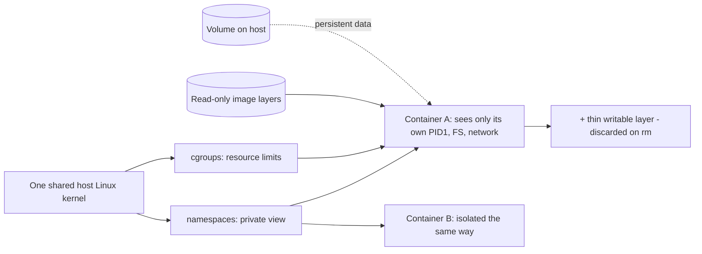

# Linux for Docker

## 1. What Is This?

How Docker **containers** are really just **isolated Linux processes**. Docker uses Linux kernel features (namespaces, cgroups) to run apps in lightweight, isolated environments.

## 2. Why Is This Needed?

Containers are everywhere in DevOps. Understanding that a container is a Linux process — not a tiny VM — makes building, running, and debugging them far easier.

## 3. Simple Layman Explanation

A container is like a **lunchbox**: it packs an app with everything it needs (libraries, files) so it runs the same anywhere. It shares the host's kitchen (the Linux kernel) but has its own sealed compartment — its own view of the shelves, its own portion of the gas and counter space.

## 4. Technical Explanation

- **Namespaces** isolate what a container sees (its own processes, network, filesystem, hostname).
- **cgroups** limit what it can use (CPU, memory).
- The container shares the **host kernel** (unlike a VM, which has its own OS).
- An **image** is a read-only template; a **container** is a running instance of it.
- Inside a container you use the same Linux commands (`ls`, `ps`, `cat`).

## 5. How It Works Under the Hood

The single most clarifying fact about Docker: **a container is a normal Linux process the kernel has been told to *lie to*.** There's no "container" object in the kernel — just a process with a restricted view and a resource budget, built from two kernel features:

- **Namespaces = what the process can *see* (isolation).** The Linux kernel can give a process its own private view of a system resource. The PID namespace makes the container's main process think it's PID 1 and hides all other host processes — so `ps` *inside* shows two or three processes, not the host's hundreds. The mount namespace gives it its own root filesystem (the image), the network namespace its own interfaces and ports, the UTS namespace its own hostname. Same kernel, different *views*. That's why the app inside genuinely believes it has the machine to itself — the kernel is curating what it sees.
- **cgroups = what the process can *use* (limits).** Control groups cap and meter resources: "this container gets at most 512 MB of RAM and 0.5 CPU." If it exceeds the memory limit, the kernel's OOM killer kills it — which is why a container can die with exit code 137 (128 + signal 9) while the host has plenty of free RAM. `docker stats` is just reading these cgroup counters. cgroups are the same mechanism systemd uses to account for services (Module 05) — Docker didn't invent it, it *orchestrates* it.
- **Why a container is NOT a VM.** A VM boots its *own kernel* on virtualized hardware — heavy, slow to start, gigabytes. A container shares the *host's* kernel and adds only the app plus its libraries — so it starts in milliseconds and weighs megabytes. The trade-off: containers are only as isolated as the kernel's namespaces make them (a kernel bug can cross the boundary), whereas VMs have a harder hardware boundary. For DevOps, "shares the host kernel" also means a container built on Linux syscalls needs a Linux kernel to run.
- **Image vs container = class vs instance.** An **image** is a read-only, layered filesystem template (each `RUN` in a Dockerfile adds a layer). A **container** is that image plus a thin *writable* layer on top, running as a process. This is why data written inside a container **vanishes when it's removed**: the writable layer is discarded, and only the immutable image remains. Persistent data must live in a **volume** (a host directory bind-mounted in), outside the throwaway layer — the same mount concept from Module 08.
- **`docker exec`, `logs`, `stats` map to your existing skills.** Because it's all just processes: `docker logs` reads the container's stdout/stderr (its journal); `docker exec -it` enters the container's namespaces and drops you into a shell where `ls`/`ps`/`cat` work normally; `docker stats` reads cgroup counters. And crucially, on the **host**, `ps aux | grep nginx` shows the container's process directly — because from the kernel's side, it was never anything but a process.

So Docker is a convenient front-end over namespaces (isolation) + cgroups (limits) + a layered filesystem (images). Every container behavior — why `ps` inside looks empty, why it died with 137, why data disappeared, why the port isn't reachable — is a Linux concept you already know, seen through the namespace lens.

## 6. Diagram



## 7. Real-World Examples

**1. The everyday case.** You run `docker run -d -p 8080:80 nginx`. Docker creates an isolated process running Nginx, mapped to host port 8080. From the host, `ps aux | grep nginx` shows it as a normal Linux process — because it is one.

**2. Proving a container is just a host process with a curated view:**

```
$ docker run -d -p 8080:80 --name web nginx
b3f9a1c2d4e5
$ docker exec web ps -e            # INSIDE: the PID namespace hides the host
    PID TTY          TIME CMD
      1 ?        00:00:00 nginx     # nginx thinks it's PID 1
     30 ?        00:00:00 nginx
$ ps -o pid,cmd -C nginx           # on the HOST: same process, real host PID
    PID CMD
  20144 nginx: master process nginx -g daemon off;
$ docker stats --no-stream web     # cgroup counters
NAME  CPU %   MEM USAGE / LIMIT   MEM %
web   0.01%   3.4MiB / 512MiB     0.66%
```

Inside, nginx is "PID 1" with almost nothing around it (namespace); on the host it's PID 20144 like any process; `docker stats` reads its cgroup — the whole Section 5 model visible at once.

**3. War story — the container that "kept crashing" with exit 137.** A team's app container restarted every few minutes with exit code **137** and no error in the app logs. They suspected a bug, but the host had gigabytes of free RAM, so it "made no sense." The cause was pure Section 5: the container had a **cgroup memory limit** of 256 MB (`--memory=256m`), the app's heap grew past it, and the **kernel OOM killer** killed the process — 137 = 128 + signal 9 (SIGKILL). The host's free RAM was irrelevant; the *cgroup* limit is what the kernel enforced. Fix: raise the limit or fix the leak. Lesson: exit 137 = OOM-killed against the container's limit, not the host's — a limits (cgroup) problem, not an app bug.

## 8. Worked Walkthrough

Debug a container the Linux way — logs, exit code, shell, ports:

```
$ docker run -d -p 8080:80 --name web nginx
$ docker ps                              # 1. is it running?
CONTAINER ID  IMAGE  STATUS         PORTS                   NAMES
b3f9a1c2d4e5  nginx  Up 5 seconds   0.0.0.0:8080->80/tcp    web
$ curl -s localhost:8080 | head -1        # 2. reachable via the mapped port?
<!DOCTYPE html>
$ docker exec -it web bash                # 3. step inside — normal Linux in here
root@b3f9a1c2d4e5:/# cat /etc/os-release | head -1
PRETTY_NAME="Debian GNU/Linux 12 (bookworm)"     # the image's OS, not the host's
root@b3f9a1c2d4e5:/# ss -ltnp                     # nginx listening on :80 INSIDE
LISTEN 0 511 0.0.0.0:80 0.0.0.0:*
root@b3f9a1c2d4e5:/# exit
$ docker logs web | tail -2               # 4. its stdout/stderr = its journal
2026/07/02 11:00:03 [notice] 1#1: start worker processes
$ docker inspect -f '{{.State.ExitCode}}' web   # 5. exit code if it stopped
0
```

`ps`/`ss`/`cat` work identically inside; `docker logs` is the journal; the exit code diagnoses failures — every debugging move is a skill from Modules 05, 07, and 09.

## 9. Commands

```bash
docker run -d -p 8080:80 --name web nginx   # run nginx in background
docker ps                                    # running containers
docker logs web                              # container's stdout/stderr (its "journal")
docker exec -it web bash                      # get a shell INSIDE the container
docker stats                                  # live CPU/mem (cgroups in action)
docker inspect web                            # full config/details
docker stop web && docker rm web              # stop and remove
ps aux | grep nginx                           # see the container process on the host
```

Sample output (dummy values, for reference):

```text
$ docker ps
CONTAINER ID  IMAGE  COMMAND                 STATUS         PORTS                  NAMES
b3f9a1c2d4e5  nginx  "/docker-entrypoint.…"  Up 2 minutes   0.0.0.0:8080->80/tcp   web

$ docker stats --no-stream
NAME  CPU %   MEM USAGE / LIMIT   MEM %   NET I/O       PIDS
web   0.00%   3.4MiB / 512MiB     0.66%   1.2kB / 0B    2

$ docker logs web | tail -1
2026/07/02 11:00:03 [notice] 1#1: start worker processes

$ docker inspect -f '{{.State.Status}} {{.State.ExitCode}}' web
running 0
```

## 10. Command Explanation

- `docker run -d -p 8080:80 nginx` → `-d` detached; `-p host:container` maps ports (Module 07). Without `-p`, the container's port isn't reachable from the host.
- `docker logs` → the container's stdout/stderr — the container equivalent of reading logs (Module 09).
- `docker exec -it web bash` → enters the container's namespaces; now `ls`, `ps`, `cat` work as normal (Section 5).
- `docker stats` → shows cgroup-enforced CPU/memory limits live — where exit 137 comes from.
- `ps aux | grep nginx` on the **host** → proof the container is a host process (Section 5).

## 11. In Production (DevOps Context)

- **Containers are the unit of deployment:** CI builds an image, a registry stores it, and Kubernetes/ECS runs it — the same image runs identically from laptop to prod because it carries its own libraries (Module 13, Kubernetes topic).
- **Least privilege inside the container:** production images set a non-root `USER`, drop Linux capabilities, and use a read-only filesystem, so a compromised app is boxed into a tiny footprint — [least-privilege](../12-linux-security-basics/least-privilege.md) applied to containers.
- **Resource limits are mandatory, not optional:** every container gets cgroup CPU/memory limits (`requests`/`limits` in K8s) so one runaway app can't starve its neighbors — and understanding exit 137 (the war story) is standard on-call knowledge.
- **Stateless by default, volumes for state:** because the writable layer is discarded (Section 5), production containers are treated as disposable; persistent data goes to volumes, databases, or object storage — never inside the container.

## 12. Practice Tasks

1. `docker run hello-world` and read the message about the Linux kernel.
2. Run Nginx with `-p 8080:80`; `curl localhost:8080`.
3. `docker exec -it web bash`, then `ps aux`, `ss -ltnp`, and `cat /etc/os-release` inside — note how few processes `ps` shows.
4. `docker logs web` and `docker stats`; run `--memory=16m` on a memory-hungry container and watch it get OOM-killed (exit 137).
5. Stop and remove the container; confirm any data written inside is gone (then repeat with a `-v` volume).

## 13. Common Mistakes

- Thinking a container is a full VM — it shares the host kernel (Section 5).
- Forgetting port mapping (`-p`), so the service is unreachable from the host.
- Storing important data only inside a container — it's lost on removal (use volumes; Section 5).
- Blaming the app for exit 137 when it's the cgroup memory limit (the war story).

## 14. Troubleshooting

**Container exits immediately**
- **Cause:** the main process failed — it's a Linux process exit.
- **Fix:** `docker logs <name>` for the error, `docker inspect -f '{{.State.ExitCode}}'` for the code (137 = OOM, 139 = segfault, non-zero = app error).

**Can't reach the app**
- **Cause:** port not mapped (`-p`), or the app binds `127.0.0.1` *inside* the container (unreachable even when mapped).
- **Fix:** add `-p host:container`; make the app bind `0.0.0.0` inside; confirm with `ss -ltnp` inside (Module 07).

**Permission denied inside the container**
- **Cause:** the same Linux permission model (Module 04) applies inside; often a volume owned by a different UID than the container's user.
- **Fix:** align ownership/permissions on the mounted volume, or run as the matching user.

**Container keeps getting killed (exit 137)**
- **Cause:** exceeded its cgroup memory limit → OOM-killed (the war story).
- **Fix:** raise `--memory` or fix the leak; check `docker stats` for usage vs limit.

## 15. Best Practices

- Treat containers as Linux processes when debugging (logs, exit codes, ports, permissions).
- Use volumes for persistent data; keep containers stateless and disposable.
- Run as a non-root user inside the container; set explicit CPU/memory limits (least privilege + cgroups).
- Keep images small and updated (fewer layers, fewer vulnerabilities).

## 16. Connects To

- **Prev:** [Linux for AWS](linux-for-aws.md). **Next:** [Linux for Kubernetes](linux-for-kubernetes.md).
- **The kernel features under it:** [Process Basics](../05-processes-and-services/process-basics.md), [ps/top/htop](../05-processes-and-services/ps-top-htop.md), [kill & Signals](../05-processes-and-services/kill-signals.md) (exit 137 = SIGKILL).
- **Ports & volumes:** [Ports & Sockets](../07-networking-basics/ports-and-sockets.md), [Mount & Umount](../08-storage-and-disk-management/mount-and-umount.md); **logs:** [journalctl Basics](../09-logs-monitoring-troubleshooting/journalctl-basics.md).
- **Non-root containers:** [Least Privilege](../12-linux-security-basics/least-privilege.md); **orchestration:** [Linux for Kubernetes](linux-for-kubernetes.md).

## 17. Quick Recap

- A container = an isolated Linux process: **namespaces** curate what it sees, **cgroups** cap what it uses, sharing the host kernel (not a VM).
- Image = read-only template; container = image + throwaway writable layer → data needs a **volume** to survive removal.
- `docker logs/exec/stats` map to journal/shell/resource checks; exit 137 = OOM-killed against the cgroup limit. Your Linux skills work unchanged inside.

## 18. References

- Docker docs: https://docs.docker.com/
- Linux namespaces: https://man7.org/linux/man-pages/man7/namespaces.7.html

<!-- NAV-FOOTER -->

---

### 🧭 Navigation

| Previous | Up | Next |
|:---|:---:|---:|
| ⬅️ Prev: [Linux for AWS](linux-for-aws.md) | ⬆️ Module: [Module 13 — Real-World Linux for DevOps](README.md) | ➡️ Next: [Linux for Kubernetes](linux-for-kubernetes.md) |
