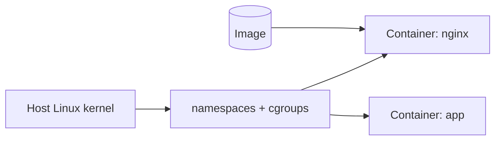

# Linux for Docker

## 1. What Is This?

How Docker **containers** are really just **isolated Linux processes**. Docker uses Linux kernel features (namespaces, cgroups) to run apps in lightweight, isolated environments.

## 2. Why Is This Needed?

Containers are everywhere in DevOps. Understanding that a container is a Linux process — not a tiny VM — makes building, running, and debugging them far easier.

## 3. Simple Layman Explanation

A container is like a **lunchbox**: it packs an app with everything it needs (libraries, files) so it runs the same anywhere. It shares the host's kitchen (the Linux kernel) but has its own sealed compartment.

## 4. Technical Explanation

- **Namespaces** isolate what a container sees (its own processes, network, filesystem, hostname).
- **cgroups** limit what it can use (CPU, memory).
- The container shares the **host kernel** (unlike a VM, which has its own OS).
- An **image** is a read-only template; a **container** is a running instance of it.
- Inside a container you use the same Linux commands (`ls`, `ps`, `cat`).

## 5. Real-World Example

You run `docker run -d -p 8080:80 nginx`. Docker creates an isolated process running Nginx, mapped to host port 8080. From the host, `ps aux | grep nginx` shows it as a normal Linux process — because it is one.

## 6. Diagram



## 7. Commands

```bash
docker run -d -p 8080:80 --name web nginx   # run nginx in background
docker ps                                    # running containers
docker logs web                              # container's stdout/stderr (its "journal")
docker exec -it web bash                      # get a shell INSIDE the container
docker stats                                  # live CPU/mem (cgroups in action)
docker inspect web                            # full config/details
docker stop web && docker rm web              # stop and remove
ps aux | grep nginx                           # see the container process on the host
```

## 8. Command Explanation

- `docker run -d -p 8080:80 nginx` → `-d` detached, `-p host:container` maps ports (Module 7 port concepts).
- `docker logs` → the container's output; the container equivalent of reading logs.
- `docker exec -it web bash` → opens a shell inside; now use `ls`, `ps`, `cat` as normal.
- `docker stats` → shows cgroup-enforced CPU/memory limits live.
- `ps aux | grep nginx` on the **host** → proof the container is a host process.

## 9. Practice Tasks

1. `docker run hello-world` and read the message about the Linux kernel.
2. Run Nginx with `-p 8080:80`; `curl localhost:8080`.
3. `docker exec -it web bash`, then `ps aux` and `cat /etc/os-release` inside.
4. `docker logs web` and `docker stats`.
5. Stop and remove the container.

## 10. Common Mistakes

- Thinking a container is a full VM (it shares the host kernel).
- Forgetting port mapping (`-p`), so the service is unreachable.
- Storing important data only inside a container (it's lost on removal — use volumes).

## 11. Troubleshooting

- **Container exits immediately** → check `docker logs`; the main process probably failed (it's a Linux process exit).
- **Can't reach the app** → port not mapped (`-p`), or the app binds `127.0.0.1` inside.
- **Permission denied in container** → same Linux permission model (Module 4) applies inside.

## 12. Best Practices

- Treat containers as Linux processes when debugging (logs, exit codes, ports, perms).
- Use volumes for persistent data.
- Run as a non-root user inside the container (least privilege).
- Keep images small and updated.

## 13. Quick Recap

- A container = isolated Linux process (namespaces + cgroups), sharing the host kernel.
- `docker logs/exec/stats` map to logs/shell/resource checks.
- Your Linux skills work the same inside containers.

## 14. References

- Docker docs: https://docs.docker.com/
- Linux namespaces: https://man7.org/linux/man-pages/man7/namespaces.7.html
