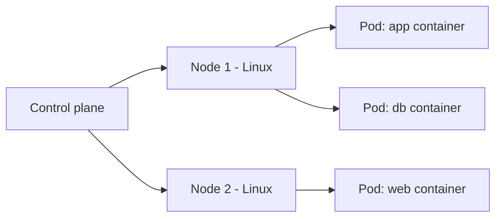

# Linux for Kubernetes

## 1. What Is This?

How **Kubernetes (K8s)** runs on Linux. Kubernetes orchestrates containers across a cluster of machines (**nodes**) — and every node is a Linux server you can troubleshoot with skills from earlier modules.

## 2. Why Is This Needed?

Kubernetes is the standard for running containers at scale. When pods crash or nodes misbehave, the root cause is often a plain Linux issue (disk full, memory pressure, networking) on a node.

## 3. Simple Layman Explanation

Kubernetes is a **logistics manager** for containers. It decides which Linux machine (node) runs which container (pod), restarts failed ones, and scales them. The managers and workers are all Linux servers.

## 4. Technical Explanation

- **Node** = a Linux machine (VM/server) in the cluster; runs the `kubelet` agent and a container runtime.
- **Pod** = the smallest unit; one or more containers (Linux processes) sharing a network namespace.
- The **control plane** schedules pods onto nodes.
- Node problems (disk, memory, CPU, networking) are diagnosed with the same Linux tools.
- `kubectl` is the client; under the hood it's containers = Linux processes on nodes.

## 5. Real-World Example

Pods are stuck "Pending". `kubectl describe node` shows `DiskPressure`. You SSH to the node, run `df -h` (Module 8), find `/var/lib/containerd` full of old images, clean up, and pods schedule again — a Linux disk problem surfacing as a K8s symptom.

## 6. Diagram



## 7. Commands

```bash
kubectl get nodes -o wide          # nodes + OS (Linux)
kubectl get pods -A                # all pods
kubectl describe node <node>       # conditions: DiskPressure, MemoryPressure
kubectl logs <pod>                 # a pod/container's logs
kubectl exec -it <pod> -- bash     # shell into a container (Linux inside)
kubectl describe pod <pod>         # events: why it won't start
kubectl top nodes ; kubectl top pods   # resource usage (needs metrics-server)
# On the node itself (SSH):
df -h ; free -h ; journalctl -u kubelet -e
```

## 8. Command Explanation

- `kubectl get nodes -o wide` → the OS column shows Linux; nodes are servers.
- `kubectl describe node` → **conditions** like DiskPressure/MemoryPressure map directly to Module 8/9 issues.
- `kubectl logs` / `exec` → container logs and shell — same as Docker, same Linux inside.
- `kubectl top` → resource usage (like `top` for the cluster).
- On the node, `df -h`, `free -h`, `journalctl -u kubelet` → classic Linux debugging.

## 9. Practice Tasks

(Use minikube/kind locally if you don't have a cluster.)
1. `kubectl get nodes -o wide` and note the OS.
2. Deploy nginx: `kubectl create deployment web --image=nginx`.
3. `kubectl get pods`, `kubectl logs <pod>`, `kubectl exec -it <pod> -- bash`.
4. `kubectl describe pod <pod>` and read the events.

## 10. Common Mistakes

- Debugging only with `kubectl` and never checking the underlying node (df/free/journalctl).
- Ignoring node conditions (DiskPressure/MemoryPressure) that are plain Linux issues.
- Forgetting that "inside a pod" is just Linux.

## 11. Troubleshooting

- **Pod Pending** → `describe pod`/`describe node`; often resource pressure on a node (Linux disk/memory).
- **CrashLoopBackOff** → `kubectl logs`; the container's main process exits (a Linux process failure).
- **Node NotReady** → SSH in; check `kubelet` (`journalctl -u kubelet`), disk, and memory.

## 12. Best Practices

- When K8s misbehaves, check the node's Linux health too.
- Set resource requests/limits (cgroups) to avoid noisy-neighbor issues.
- Monitor disk on nodes (image/log buildup fills them).
- Keep nodes patched and time-synced.

## 13. Quick Recap

- Nodes are Linux servers; pods are containers (Linux processes).
- `kubectl logs/exec/describe/top` mirror Linux log/shell/resource tools.
- Many K8s problems are Linux problems on a node.

## 14. References

- Kubernetes docs: https://kubernetes.io/docs/
- kubectl cheatsheet: https://kubernetes.io/docs/reference/kubectl/cheatsheet/
