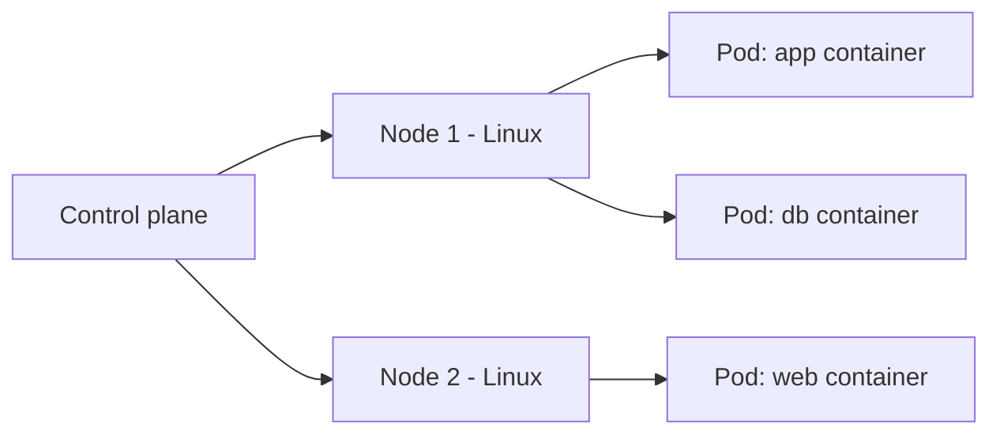
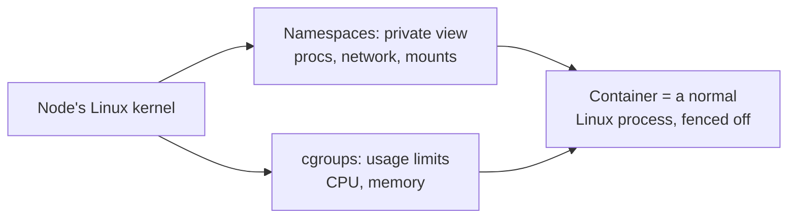

# Linux for Kubernetes

## 1. What Is This?

How **Kubernetes (K8s)** runs on Linux. Kubernetes orchestrates containers across a cluster of machines (**nodes**) — and every node is a Linux server you can troubleshoot with skills from earlier modules.

## 2. Why Is This Needed?

Kubernetes is the standard for running containers at scale. When pods crash or nodes misbehave, the root cause is often a plain Linux issue (disk full, memory pressure, networking) on a node.

## 3. Simple Layman Explanation

Kubernetes is a **logistics manager** for containers. It decides which Linux machine (node) runs which container (pod), restarts failed ones, and scales them. The managers and workers are all Linux servers.

## 4. Technical Explanation

- **Node** = a Linux machine (VM/server) in the cluster; runs the `kubelet` agent and a container runtime.
- **Pod** = the smallest unit; one or more containers (Linux processes) sharing a network namespace.
- The **control plane** schedules pods onto nodes.
- Node problems (disk, memory, CPU, networking) are diagnosed with the same Linux tools.
- `kubectl` is the client; under the hood it's containers = Linux processes on nodes.

## 5. How It Works Under the Hood

Here's the idea that makes Kubernetes click: **a container is not a special kind of thing — it's just an ordinary Linux process that the kernel has fenced off.** Kubernetes doesn't invent isolation; it drives two Linux kernel features you can reason about directly:

- **Namespaces** decide what a process can *see*. Each container gets its own view of the process list, network interfaces, mounts, and hostname. That's why `ps` inside a pod shows only *its* processes and why each pod has its own IP — the kernel is showing that process a private version of those resources. Same kernel, different view.
- **cgroups (control groups)** decide what a process can *use* — how much CPU and memory. When you set `resources.limits` on a pod, Kubernetes writes those numbers into a cgroup. If the process exceeds its memory limit, the **Linux kernel's OOM killer** terminates it — which surfaces in K8s as `OOMKilled`. The limit was never enforced by Kubernetes; it was enforced by the kernel.

So the layers are: **kubelet** (a Linux service, managed by systemd — Module 5) tells the **container runtime** (containerd) to start a process with the right namespaces and cgroups. The "pod" is that fenced process plus its private network namespace. `kubectl exec ... -- bash` simply drops you into that namespace — which is why it *feels* like a separate machine but is really the same node's kernel.

**Why this matters:** every dramatic K8s symptom decodes to a plain Linux event. `OOMKilled` = kernel OOM killer hit a cgroup limit (Module 9). `DiskPressure` = the node's disk is filling (Module 8). `CrashLoopBackOff` = a Linux process keeps exiting non-zero (Module 5). Once you see the kernel underneath, K8s troubleshooting becomes Linux troubleshooting with a new vocabulary.

## 6. Diagram



What a "pod" really is on the node:



## 7. Real-World Examples

**1. The everyday case — reading a pod's logs.** `kubectl logs <pod>` shows a container's stdout — which is just a Linux process's standard output, the same stream you'd see running it directly. No magic; you're reading a process's output on a node.

**2. Decoding a status with real output — `OOMKilled`.** A pod keeps restarting. `kubectl describe pod` shows:

```
    Last State:     Terminated
      Reason:       OOMKilled
      Exit Code:    137
```

Exit code **137** = 128 + 9, i.e. the process was killed by **signal 9 (SIGKILL)** — the kernel's OOM killer enforcing the cgroup memory limit (Section 5 + Module 5 signals + Module 9 memory). The fix is a Linux-level insight: the app needs a higher memory limit or a memory leak fixed, not a Kubernetes tweak.

**3. Production war story — pods stuck "Pending" from a full disk.** New pods won't schedule. `kubectl describe node` shows:

```
  Conditions:
    Type            Status
    DiskPressure    True          # <- the scheduler won't place pods here
```

SSH to the node and it's a Module 8 problem, plain as day:

```
$ df -h /var/lib/containerd
Filesystem      Size  Used Avail Use% Mounted on
/dev/nvme0n1p1  100G  100G    0G 100% /var/lib/containerd   # full of old images/layers
```

Old image layers filled the disk. Prune them, `DiskPressure` clears, and pods schedule again. A Linux disk problem that only *looked* like a Kubernetes scheduling problem.

## 8. Worked Walkthrough

Do this on a local cluster (minikube or kind). The goal is to *see the Linux underneath* at each step.

```
$ kubectl get nodes -o wide
NAME       STATUS   ROLES           OS-IMAGE             CONTAINER-RUNTIME
minikube   Ready    control-plane   Ubuntu 22.04         containerd://1.7.x   # nodes are Linux servers
```

```
$ kubectl create deployment web --image=nginx
$ kubectl get pods
NAME                   READY   STATUS    RESTARTS   AGE
web-5d8...             1/1     Running   0          20s
```

```
$ kubectl exec -it web-5d8... -- ps aux
USER   PID  ...  COMMAND
root     1  ...  nginx: master process    # PID 1 inside its own namespace — a normal Linux process
root    31  ...  nginx: worker process
```

Inside the pod, `ps` shows only nginx and its workers — the **process namespace** at work (Section 5). It looks like a fresh machine, but it's a fenced view of the node's kernel.

```
$ kubectl top pod web-5d8...
NAME          CPU(cores)   MEMORY(bytes)
web-5d8...     1m           8Mi                # cgroup accounting — the same numbers a limit would cap
```

```
$ kubectl describe pod web-5d8... | grep -A3 Events
Events:
  Normal  Scheduled  ...  Successfully assigned default/web-... to minikube
  Normal  Pulled     ...  Container image "nginx" already present on machine
```

The **Events** section is where K8s tells you *why* something did or didn't happen — always read it first when a pod misbehaves.

## 9. Commands

```bash
kubectl get nodes -o wide          # nodes + OS (Linux)
kubectl get pods -A                # all pods
kubectl describe node <node>       # conditions: DiskPressure, MemoryPressure
kubectl logs <pod>                 # a pod/container's logs
kubectl exec -it <pod> -- bash     # shell into a container (Linux inside)
kubectl describe pod <pod>         # events + Last State (e.g. OOMKilled): why it won't start
kubectl top nodes ; kubectl top pods   # resource usage (needs metrics-server)
# On the node itself (SSH):
df -h ; free -h ; journalctl -u kubelet -e
```

Sample output for each (dummy values, for reference):

```text
$ kubectl get nodes -o wide
NAME      STATUS   ROLES           AGE   VERSION   OS-IMAGE       CONTAINER-RUNTIME
node-1    Ready    control-plane   40d   v1.29.2   Ubuntu 22.04   containerd://1.7.13
node-2    Ready    <none>          40d   v1.29.2   Ubuntu 22.04   containerd://1.7.13

$ kubectl get pods -A
NAMESPACE     NAME                     READY   STATUS    RESTARTS   AGE
default       web-5d8f9c7b4-abcde      1/1     Running   0          2m
kube-system   coredns-76f-xyz12        1/1     Running   0          40d

$ kubectl describe node node-2 | grep -A5 Conditions
Conditions:
  Type             Status
  MemoryPressure   False
  DiskPressure     False
  Ready            True

$ kubectl logs web-5d8f9c7b4-abcde
10.0.0.5 - - [02/Jul/2026:10:00:01 +0000] "GET / HTTP/1.1" 200 612

$ kubectl describe pod web-5d8f9c7b4-abcde | grep -A3 "Last State"
    Last State:     Terminated
      Reason:       OOMKilled
      Exit Code:    137

$ kubectl top pods
NAME                    CPU(cores)   MEMORY(bytes)
web-5d8f9c7b4-abcde     1m           8Mi

$ df -h /var/lib/containerd
Filesystem      Size  Used Avail Use% Mounted on
/dev/nvme0n1p1  100G   42G   58G  42% /
```

## 10. Command Explanation

- `kubectl get nodes -o wide` → the OS column shows Linux; nodes are servers.
- `kubectl describe node` → **conditions** like DiskPressure/MemoryPressure map directly to Module 8/9 issues.
- `kubectl logs` / `exec` → container logs and shell — same as Docker, same Linux inside.
- `kubectl describe pod` → read **Last State** (`OOMKilled`, exit codes) and **Events** to see the underlying Linux cause.
- `kubectl top` → resource usage (like `top` for the cluster), sourced from cgroup accounting.
- On the node, `df -h`, `free -h`, `journalctl -u kubelet` → classic Linux debugging.

## 11. In Production (DevOps Context)

- **Right-sizing:** `requests`/`limits` are just cgroup settings. Too low → `OOMKilled`; too high → wasted, unschedulable capacity. Reading `kubectl top` (cgroup data) guides the numbers.
- **Node health is your job:** managed clusters (EKS/GKE/AKS) still run Linux nodes that fill up with images and logs; disk/memory monitoring (Modules 8–9) prevents the "Pending pods" incident above.
- **Security:** `securityContext.runAsUser` sets the Linux UID a container runs as — which then drives file permission checks on mounted volumes (Module 4). Running as root inside containers is a real risk.
- **Time & DNS:** cluster networking depends on in-cluster DNS (CoreDNS) and time sync; both are Linux-service problems when they break (Module 7).

## 12. Practice Tasks

(Use minikube/kind locally if you don't have a cluster.)
1. `kubectl get nodes -o wide` and note the OS.
2. Deploy nginx: `kubectl create deployment web --image=nginx`.
3. `kubectl get pods`, `kubectl logs <pod>`, then `kubectl exec -it <pod> -- ps aux` — confirm the process namespace shows only that pod's processes.
4. `kubectl describe pod <pod>` and read the **Events** section.
5. `kubectl top pod <pod>` and relate the numbers to cgroup accounting from Section 5.

## 13. Common Mistakes

- Debugging only with `kubectl` and never checking the underlying node (df/free/journalctl).
- Treating `OOMKilled`/`DiskPressure` as mysterious K8s states instead of plain kernel/Linux events.
- Ignoring node conditions (DiskPressure/MemoryPressure) that are plain Linux issues.
- Forgetting that "inside a pod" is just Linux — a fenced process, not a separate machine.

## 14. Troubleshooting

- **Pod Pending** → `describe pod`/`describe node`; often resource pressure on a node (Linux disk/memory).
- **CrashLoopBackOff** → `kubectl logs`; the container's main process exits non-zero (a Linux process failure, Module 5).
- **OOMKilled (exit 137)** → the kernel OOM killer hit the cgroup memory limit; raise the limit or fix the leak (Module 9).
- **Node NotReady** → SSH in; check `kubelet` (`journalctl -u kubelet`), disk, and memory.

## 15. Best Practices

- When K8s misbehaves, check the node's Linux health too.
- Set resource requests/limits (cgroups) to avoid noisy-neighbor issues and OOM kills.
- Monitor disk on nodes (image/log buildup fills them).
- Run containers as non-root where possible; keep nodes patched and time-synced.

## 16. Connects To

- **Builds on:** [Linux for Docker](linux-for-docker.md) — same namespaces/cgroups, one pod at a time.
- **Diagnosed with:** [Processes & Services](../05-processes-and-services/README.md) (signals, systemd/kubelet), [Storage & Disk](../08-storage-and-disk-management/README.md) (DiskPressure), [Logs & Monitoring](../09-logs-monitoring-troubleshooting/README.md) (OOM/memory).
- **Security ties to:** [File Permissions](../04-users-groups-permissions/file-permissions.md) via `securityContext`.
- **Next:** [Linux for CI/CD](linux-for-ci-cd.md).

## 17. Quick Recap

- Nodes are Linux servers; a pod is a normal Linux **process** fenced by **namespaces** (what it sees) and **cgroups** (what it uses).
- Dramatic K8s states decode to Linux events: `OOMKilled` = kernel OOM on a cgroup limit, `DiskPressure` = full disk, `CrashLoopBackOff` = process exits non-zero.
- `kubectl logs/exec/describe/top` mirror Linux log/shell/resource tools; check the node too.

## 18. References

- Kubernetes docs: https://kubernetes.io/docs/
- kubectl cheatsheet: https://kubernetes.io/docs/reference/kubectl/cheatsheet/

<!-- NAV-FOOTER -->

---

### 🧭 Navigation

| Previous | Up | Next |
|:---|:---:|---:|
| ⬅️ Prev: [Linux for Docker](linux-for-docker.md) | ⬆️ Module: [Module 13 — Real-World Linux for DevOps](README.md) | ➡️ Next: [Linux for CI/CD](linux-for-ci-cd.md) |
