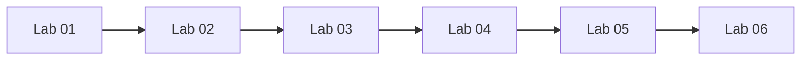

# Module 14 — Hands-On Labs

## What You Will Learn

Practical, guided exercises that combine the skills from earlier modules into realistic tasks. Labs progress from basic commands to full debugging scenarios.

## Why This Module Matters

Reading builds understanding; **doing** builds skill. These labs turn knowledge into muscle memory and confidence — exactly what interviews and real jobs test.

## Real-World Use Case

Each lab mirrors a real task: navigating a server, fixing permissions, debugging a service, diagnosing a network issue, recovering from a full disk, and automating with a script.

## Labs

| Lab | Focus | Modules |
|-----|-------|---------|
| [Lab 01](./lab-01-basic-commands.md) | Basic commands & navigation | 02, 03 |
| [Lab 02](./lab-02-user-permission-practice.md) | Users & permissions | 04 |
| [Lab 03](./lab-03-process-service-debugging.md) | Process & service debugging | 05, 09 |
| [Lab 04](./lab-04-network-debugging.md) | Network debugging | 07 |
| [Lab 05](./lab-05-disk-full-scenario.md) | Disk-full recovery | 08 |
| [Lab 06](./lab-06-shell-script-automation.md) | Shell script automation | 10, 11 |

## Learning Flow

## How to Use the Labs

- Use a **safe environment** (WSL, VM, or throwaway cloud VM — Module 01).
- Type every command yourself; don't copy-paste blindly.
- Each lab has **Validation** and **Cleanup** steps — always run cleanup.

## Lab Structure

Every lab includes: Objective, Scenario, Prerequisites, Steps & Commands, Expected Output, Explanation, Validation, Cleanup, and Troubleshooting.

## Best Practices

- Read the whole lab once, then do it.
- If something breaks, treat it as bonus troubleshooting practice.

## Quick Revision

These labs consolidate Modules 02–11. After finishing, you can navigate, secure, debug, and automate a Linux server end to end.

## Next Module

➡️ [15 — Mini Projects](../15-mini-projects/).
