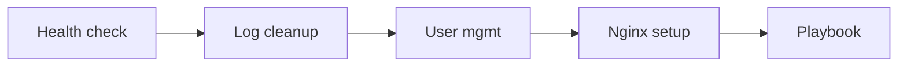

# Module 15 — Mini Projects

## What You Will Learn

Apply everything you've learned to build small, genuinely useful tools and setups — the kind you can show in a portfolio or use at work.

## Why This Module Matters

Projects prove you can combine skills to solve real problems. They're also great interview talking points and the bridge from "learner" to "practitioner."

## Real-World Use Case

Each project mirrors a real DevOps/SysAdmin task: monitoring server health, automating cleanup, managing users, deploying a web server, and codifying troubleshooting knowledge.

## Projects

| Project | What You Build | Modules |
|---------|----------------|---------|
| [Project 01](./project-01-linux-health-check-script.md) | Server health-check script | 09, 10 |
| [Project 02](./project-02-log-cleanup-automation.md) | Automated log cleanup | 08, 10, 11 |
| [Project 03](./project-03-user-management-script.md) | User-management script | 04, 10 |
| [Project 04](./project-04-simple-nginx-server-setup.md) | Nginx web server setup | 05, 06, 12 |
| [Project 05](./project-05-troubleshooting-playbook.md) | Troubleshooting playbook | 05, 07, 08, 09 |

## Learning Flow

## Project Structure

Each project includes: Problem Statement, Real-World Use Case, Architecture/Flow Diagram, Files to Create, Commands, Commented Code, Line-by-Line Explanation, Testing Steps, Troubleshooting, and Improvement Ideas.

## How to Use

- Build on a safe environment (Module 01).
- Type and understand each line — don't just paste.
- Extend each project with the "Improvement Ideas" once it works.

## Best Practices

- Keep scripts safe (`set -euo pipefail`, validation, no destructive defaults).
- Version-control your projects; write a short README for each.

## Quick Revision

These projects consolidate scripting, monitoring, security, and services into deliverables you can reuse and showcase.

## Next Module

➡️ [16 — Cheatsheets](../16-cheatsheets/).
