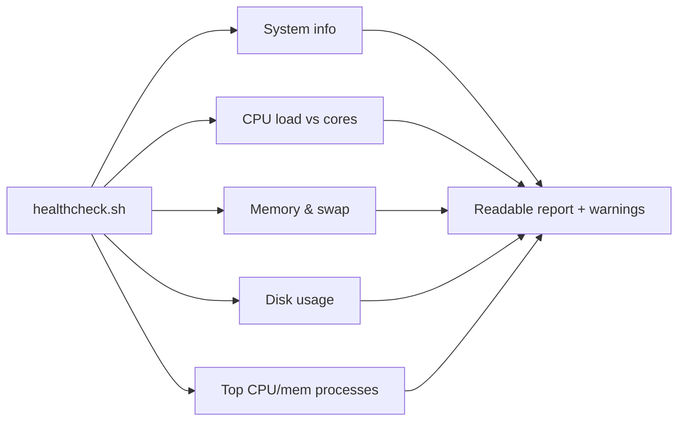

# Project 01 — Linux Health-Check Script

## Problem Statement

Build a single script that reports a server's health at a glance: hostname/uptime, CPU load, memory, disk usage, and top resource consumers — with warnings when thresholds are crossed.

## Real-World Use Case

Run it manually for a quick health snapshot, or via cron every few minutes to log trends and warn before incidents. It's the kind of script every ops engineer keeps in their toolbox.

## Architecture / Flow Diagram



## Files to Create

- `~/projects/healthcheck/healthcheck.sh`

## Commands

```bash
mkdir -p ~/projects/healthcheck
# create the script (below), then:
chmod +x ~/projects/healthcheck/healthcheck.sh
~/projects/healthcheck/healthcheck.sh
```

## Code (commented)

Save as `healthcheck.sh`:

```bash
#!/bin/bash
# healthcheck.sh - quick Linux server health report
set -euo pipefail

DISK_WARN="${1:-80}"     # warn if any filesystem use% >= this (default 80)
MEM_WARN="${2:-90}"      # warn if memory use% >= this (default 90)

line() { printf '%s\n' "------------------------------------------"; }

echo "Health Check - $(hostname) - $(date)"
line

# --- System / uptime ---
echo "Uptime & load:"
uptime
CORES="$(nproc)"
echo "CPU cores: $CORES"
line

# --- Memory ---
echo "Memory:"
free -h
# Compute memory use% (used/total*100) from free
MEM_PCT="$(free | awk '/^Mem:/ {printf "%.0f", $3/$2*100}')"
echo "Memory used: ${MEM_PCT}%"
if [ "$MEM_PCT" -ge "$MEM_WARN" ]; then
    echo "WARNING: memory usage ${MEM_PCT}% >= ${MEM_WARN}%"
fi
line

# --- Disk ---
echo "Disk usage (warn >= ${DISK_WARN}%):"
df -h --output=source,pcent,target -x tmpfs -x devtmpfs | sed 1d | while read -r src pct tgt; do
    num="${pct%\%}"                       # strip the % sign
    flag=""
    [ "$num" -ge "$DISK_WARN" ] && flag="  <-- WARNING"
    printf "  %-20s %4s %s%s\n" "$src" "$pct" "$tgt" "$flag"
done
line

# --- Top consumers ---
echo "Top 5 CPU:"
ps -eo pid,comm,%cpu --sort=-%cpu | head -6
echo
echo "Top 5 Memory:"
ps -eo pid,comm,%mem --sort=-%mem | head -6
line
echo "Done."
```

## Line-by-Line Explanation (key parts)

- `DISK_WARN="${1:-80}"` → first argument or default 80; thresholds are configurable.
- `line()` → a small helper function for separators (Module 10 functions).
- `free | awk '/^Mem:/ {printf "%.0f", $3/$2*100}'` → computes memory use% from the `Mem:` row (`$3`=used, `$2`=total).
- The `df ... | while read` loop → strips the `%`, compares to the threshold, and flags filesystems over the limit.
- `ps -eo ... --sort=-%cpu | head -6` → top CPU/memory processes (header + 5).

## Testing Steps

1. `chmod +x healthcheck.sh && ./healthcheck.sh`.
2. Force a disk warning with a low threshold: `./healthcheck.sh 1 1`.
3. Generate CPU load (`yes >/dev/null &`), re-run, see it in "Top 5 CPU", then `pkill yes`.
4. Schedule it (Module 11): `*/5 * * * * ~/projects/healthcheck/healthcheck.sh >> ~/health.log 2>&1`.

## Troubleshooting

- **`nproc`/`free` missing** → install `coreutils`/`procps`.
- **awk math errors** → ensure `free` output format is standard; locale issues can change decimals.
- **Permission denied** → `chmod +x` the script.

## Improvement Ideas

- Add color output (green/yellow/red) and an overall PASS/WARN status.
- Send an alert (email/Slack webhook) only when a warning fires.
- Append results as CSV for trend graphing.
- Add checks for failed systemd services (`systemctl --failed`).

## References

- [Module 09 resource checks](../09-logs-monitoring-troubleshooting/cpu-memory-disk-checks.md)
- [Module 10 shell scripting](../10-shell-scripting/)

<!-- NAV-FOOTER -->

---

### 🧭 Navigation

| Previous | Up | Next |
|:---|:---:|---:|
| ⬅️ Prev: [Module 15 — Mini Projects](README.md) | ⬆️ Module: [Module 15 — Mini Projects](README.md) | ➡️ Next: [Project 02 — Log Cleanup Automation](project-02-log-cleanup-automation.md) |
