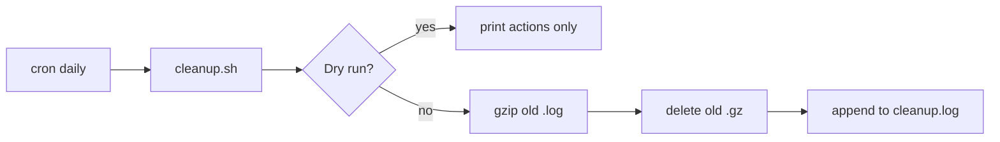

# Project 02 — Log Cleanup Automation

## Problem Statement

Build an automated, safe log-cleanup system: a script that compresses and prunes logs in a target directory, plus a cron schedule and a logrotate config — so logs never fill the disk.

## Real-World Use Case

App logs that no tool manages will eventually fill `/var`. This project keeps any log directory under control automatically, with a dry-run mode so you can trust it before deleting anything.

## Architecture / Flow Diagram



## Files to Create

- `~/projects/logclean/cleanup.sh`
- A cron entry
- (Optional) `/etc/logrotate.d/myapp`

## Commands

```bash
mkdir -p ~/projects/logclean
chmod +x ~/projects/logclean/cleanup.sh
# Dry run first!
~/projects/logclean/cleanup.sh /tmp/logdemo 7 30 --dry-run
```

## Code (commented)

Save as `cleanup.sh`:

```bash
#!/bin/bash
# cleanup.sh <log-dir> <compress-days> <delete-days> [--dry-run]
# Compress old .log files and delete old .gz archives, safely.
set -euo pipefail

LOG_DIR="${1:-}"
COMPRESS_DAYS="${2:-7}"
DELETE_DAYS="${3:-30}"
MODE="${4:-}"                    # pass --dry-run to preview

if [ -z "$LOG_DIR" ]; then
    echo "Usage: $0 <log-dir> <compress-days> <delete-days> [--dry-run]" >&2
    exit 1
fi
if [ ! -d "$LOG_DIR" ]; then
    echo "Error: '$LOG_DIR' is not a directory" >&2
    exit 1
fi

DRY=0
[ "$MODE" = "--dry-run" ] && DRY=1

echo "[$(date)] Cleanup in $LOG_DIR (compress >${COMPRESS_DAYS}d, delete >${DELETE_DAYS}d, dry=$DRY)"

# Compress old logs
while IFS= read -r f; do
    if [ "$DRY" -eq 1 ]; then
        echo "WOULD compress: $f"
    else
        echo "Compressing: $f"; gzip -- "$f"
    fi
done < <(find "$LOG_DIR" -type f -name '*.log' -mtime +"$COMPRESS_DAYS")

# Delete old archives
while IFS= read -r f; do
    if [ "$DRY" -eq 1 ]; then
        echo "WOULD delete: $f"
    else
        echo "Deleting: $f"; rm -f -- "$f"
    fi
done < <(find "$LOG_DIR" -type f -name '*.gz' -mtime +"$DELETE_DAYS")

echo "[$(date)] Cleanup complete."
```

## Line-by-Line Explanation (key parts)

- Inputs validated; `--dry-run` sets `DRY=1` to **preview** without changing files (build trust first).
- `find ... -name '*.log' -mtime +N` → selects `.log` files older than N days.
- `while IFS= read -r f; do ... done < <(find ...)` → **process substitution**; safely iterates filenames (handles spaces).
- `gzip -- "$f"` / `rm -f -- "$f"` → `--` prevents filenames being read as options; only matched files are touched.
- Everything is timestamped and printed, so the cron log is auditable.

## Testing Steps

1. Create demo logs:
   ```bash
   mkdir -p /tmp/logdemo
   touch -d '10 days ago' /tmp/logdemo/old.log
   touch -d '40 days ago' /tmp/logdemo/ancient.gz
   ```
2. Dry run: `~/projects/logclean/cleanup.sh /tmp/logdemo 7 30 --dry-run` (shows WOULD lines).
3. Real run: drop `--dry-run`; confirm `old.log` → `old.log.gz` and `ancient.gz` removed.
4. Schedule (Module 11):
   ```cron
   30 3 * * * $HOME/projects/logclean/cleanup.sh /var/log/myapp 7 30 >> $HOME/projects/logclean/cleanup.log 2>&1
   ```

## Troubleshooting

- **Nothing matched** → check file ages (`stat`) and patterns; logs may be newer than the threshold.
- **Permission denied** → run with rights to the target dir, or use a system path with sudo/cron-as-root.
- **Cron didn't run** → see [cron-troubleshooting](../11-automation-and-cron/cron-troubleshooting.md); use absolute paths.

## Improvement Ideas

- Add a size-based trigger (only clean if dir exceeds X MB).
- Email a summary of actions.
- Pair with a `/etc/logrotate.d/` config for system logs (Module 08).
- Add exclusions for logs that must be retained for compliance.

## References

- [Module 08 log cleanup](../08-storage-and-disk-management/log-cleanup-basics.md)
- [Module 10 log-cleanup example](../10-shell-scripting/log-cleanup-script-example.md)
