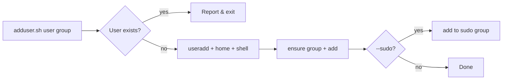

# Project 03 — User-Management Script

## Problem Statement

Build a script that creates a user, adds them to a group, sets up their home, and optionally grants sudo — with validation and an idempotent, safe design.

## Real-World Use Case

Onboarding new team members consistently. Instead of manual `useradd`/`usermod` steps (easy to get wrong), one reviewed script does it the same way every time.

## Architecture / Flow Diagram



## Files to Create

- `~/projects/usermgmt/adduser.sh`

## Commands

```bash
mkdir -p ~/projects/usermgmt
chmod +x ~/projects/usermgmt/adduser.sh
sudo ~/projects/usermgmt/adduser.sh alice devteam
sudo ~/projects/usermgmt/adduser.sh bob devteam --sudo
```

## Code (commented)

Save as `adduser.sh`:

```bash
#!/bin/bash
# adduser.sh <username> <group> [--sudo]
# Safely create a user, ensure a group, add membership, optional sudo.
set -euo pipefail

# Must run as root (creating users needs privilege)
if [ "$(id -u)" -ne 0 ]; then
    echo "Please run as root (use sudo)." >&2
    exit 1
fi

USERNAME="${1:-}"
GROUP="${2:-}"
GRANT_SUDO="${3:-}"

if [ -z "$USERNAME" ] || [ -z "$GROUP" ]; then
    echo "Usage: $0 <username> <group> [--sudo]" >&2
    exit 1
fi

# Idempotent: skip if the user already exists
if id "$USERNAME" >/dev/null 2>&1; then
    echo "User '$USERNAME' already exists - nothing to do."
    exit 0
fi

# Ensure the group exists
if ! getent group "$GROUP" >/dev/null; then
    echo "Creating group: $GROUP"
    groupadd "$GROUP"
fi

# Create the user with home dir and bash shell
echo "Creating user: $USERNAME"
useradd -m -s /bin/bash -g "$GROUP" "$USERNAME"

# Set a temporary password and force change on first login
TEMP_PW="$(openssl rand -base64 12)"
echo "${USERNAME}:${TEMP_PW}" | chpasswd
passwd --expire "$USERNAME"            # force reset at first login

# Optional sudo
if [ "$GRANT_SUDO" = "--sudo" ]; then
    SUDO_GROUP="sudo"                  # 'wheel' on RHEL
    getent group "$SUDO_GROUP" >/dev/null || SUDO_GROUP="wheel"
    usermod -aG "$SUDO_GROUP" "$USERNAME"
    echo "Granted sudo via group '$SUDO_GROUP'."
fi

echo "Done. Temporary password for $USERNAME: $TEMP_PW"
echo "(User must change it at first login.)"
```

## Line-by-Line Explanation (key parts)

- Root check (`id -u -ne 0`) → user management requires privilege; fail early with a clear message.
- `id "$USERNAME"` guard → **idempotent**: re-running won't error or duplicate.
- `getent group` → create the group only if missing.
- `useradd -m -s /bin/bash -g "$GROUP"` → home dir, bash shell, primary group (Module 04).
- `openssl rand` + `chpasswd` + `passwd --expire` → set a random temp password and force a reset at first login (good security hygiene).
- `usermod -aG sudo` (or `wheel`) → grants sudo via group; `-a` appends (never drops existing groups).

## Testing Steps

1. `sudo ./adduser.sh alice devteam` → `id alice` shows the group.
2. Re-run the same command → it reports "already exists" and exits 0 (idempotent).
3. `sudo ./adduser.sh bob devteam --sudo` → `groups bob` includes `sudo`/`wheel`.
4. Confirm password expiry: `sudo chage -l alice` shows it must be changed.

## Troubleshooting

- **"Please run as root"** → prefix with `sudo`.
- **`openssl: command not found`** → install `openssl`, or substitute another password method.
- **No `sudo` group (RHEL)** → the script falls back to `wheel`.
- **Group change not active for a logged-in user** → they must re-login.

## Improvement Ideas

- Add a `--remove <user>` mode (with confirmation) for offboarding.
- Read users from a CSV to batch-create a whole team.
- Install an SSH public key into `~/.ssh/authorized_keys` (Module 12).
- Log all actions to an audit file.

## References

- [Module 04 users & groups](../04-users-groups-permissions/users-and-groups.md)
- [Module 12 least privilege](../12-linux-security-basics/least-privilege.md)

<!-- NAV-FOOTER -->

---

### 🧭 Navigation

| Previous | Up | Next |
|:---|:---:|---:|
| ⬅️ Prev: [Project 02 — Log Cleanup Automation](project-02-log-cleanup-automation.md) | ⬆️ Module: [Module 15 — Mini Projects](README.md) | ➡️ Next: [Project 04 — Simple Nginx Server Setup](project-04-simple-nginx-server-setup.md) |
