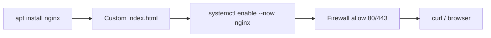

# Project 04 — Simple Nginx Server Setup

## Problem Statement

Install and configure **Nginx** to serve a simple website, enable it at boot, open the firewall, and verify it works — a complete mini web-server deployment.

## Real-World Use Case

This is the foundation of countless deployments: a web server serving static content or proxying an app. It ties together packages, services, permissions, firewall, and verification.

## Architecture / Flow Diagram



## Files to Create

- `/var/www/mysite/index.html` (web content)
- `/etc/nginx/sites-available/mysite` (server config — Debian/Ubuntu)

## Commands

```bash
# 1. Install Nginx (Module 06)
sudo apt update && sudo apt install -y nginx

# 2. Enable + start at boot (Module 05)
sudo systemctl enable --now nginx
systemctl status nginx --no-pager

# 3. Create site content
sudo mkdir -p /var/www/mysite
echo "<h1>Hello from Nginx on $(hostname)</h1>" | sudo tee /var/www/mysite/index.html

# 4. Set ownership/permissions (Module 04)
sudo chown -R www-data:www-data /var/www/mysite
sudo find /var/www/mysite -type d -exec chmod 755 {} \;
sudo find /var/www/mysite -type f -exec chmod 644 {} \;
```

Server block — save as `/etc/nginx/sites-available/mysite`:

```nginx
server {
    listen 80;
    server_name _;                         # match any hostname
    root /var/www/mysite;                   # where our files live
    index index.html;

    location / {
        try_files $uri $uri/ =404;          # serve file or 404
    }
}
```

Enable the site and reload:

```bash
sudo ln -s /etc/nginx/sites-available/mysite /etc/nginx/sites-enabled/mysite
sudo rm -f /etc/nginx/sites-enabled/default     # remove default site
sudo nginx -t                                    # validate config FIRST
sudo systemctl reload nginx                      # apply without downtime

# 5. Firewall (Module 12)
sudo ufw allow 80,443/tcp 2>/dev/null || true

# 6. Verify
curl -s -o /dev/null -w "HTTP %{http_code}\n" http://localhost
curl -s http://localhost | head
```

## Line-by-Line Explanation (key parts)

- `systemctl enable --now nginx` → start now **and** at boot (Module 05).
- `tee` with `sudo` → writes the file as root (a plain `>` wouldn't have permission).
- `chown www-data` + `find ... chmod` → Nginx's user owns the files; dirs `755`, files `644` (Module 04 best practice).
- The `server {}` block → listens on port 80, serves `/var/www/mysite`, `try_files` returns the file or a 404.
- `ln -s ... sites-enabled` → Debian/Ubuntu enable pattern (a symlink, Module 03).
- `nginx -t` → **validate before reload** (Module 05 service troubleshooting).
- `ufw allow 80,443` → opens the web ports.

## Testing Steps

1. `curl http://localhost` returns your `<h1>` content (HTTP 200).
2. From another machine/browser, visit `http://<server-ip>` (ensure cloud security group allows 80).
3. `systemctl is-enabled nginx` returns `enabled`.
4. Break the config (typo), run `nginx -t` to see it caught, then fix.

## Troubleshooting

- **`nginx -t` fails** → read the error/line; fix the config before reloading (Module 05).
- **Port 80 in use** → `sudo ss -ltnp | grep :80`; stop the conflicting service (e.g., Apache).
- **403 Forbidden** → file/dir permissions or wrong `root`; ensure `www-data` can read and dirs are `755`.
- **Unreachable remotely** → host firewall (ufw) and/or cloud security group; both must allow 80 (Module 07/12).

## Improvement Ideas

- Add HTTPS with a free Let's Encrypt certificate (`certbot`).
- Reverse-proxy a backend app (`proxy_pass`).
- Add a custom 404 page and access logging.
- Containerize it with Docker (Module 13).

## References

- Nginx docs: https://nginx.org/en/docs/
- [Module 05 services](../05-processes-and-services/systemd-services.md), [Module 12 firewall](../12-linux-security-basics/firewall-basics-ufw-firewalld.md)
