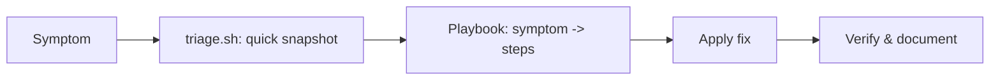

# Project 05 — Troubleshooting Playbook

## Problem Statement

Create a reusable **troubleshooting playbook**: a structured document (and a quick triage script) that maps common symptoms to diagnostic steps and fixes, so anyone on the team can respond consistently.

## Real-World Use Case

During incidents people forget steps under pressure. A playbook turns tribal knowledge into a repeatable process — the backbone of on-call and SRE work.

## Architecture / Flow Diagram



## Files to Create

- `~/projects/playbook/PLAYBOOK.md` (the document below)
- `~/projects/playbook/triage.sh` (a quick snapshot script)

## The Playbook (symptom → action)

| Symptom | First Checks | Likely Cause | Fix | Module |
|---------|--------------|--------------|-----|--------|
| Server slow | `uptime`, `top`, `free -h`, `iostat` | CPU/mem/IO pressure | Kill hog / add resources | 09 |
| Service won't start | `systemctl status`, `journalctl -u svc -e` | Config/port/permission | Fix config, free port, restart | 05 |
| Disk full | `df -h`, `du -sh */`, `lsof \| grep deleted` | Logs/temp/deleted-open | Truncate, vacuum, restart holder | 08 |
| Can't connect | `getent hosts`, `ping`, `ss -ltnp`, `curl -v` | DNS/port/firewall/app | Fix per failing layer | 07 |
| Permission denied | `id`, `ls -l`, `namei -l` | Wrong owner/perms | `chmod`/`chown`/`sudo` | 04 |
| High memory / OOM | `free -h`, `dmesg \| grep -i oom` | Memory leak/limit | Restart, limit, add RAM | 09 |
| Cron job missing | `crontab -l`, `grep CRON /var/log/syslog` | Env/path/logging | Absolute paths + `PATH=` | 11 |

## triage.sh (commented)

Save as `triage.sh`:

```bash
#!/bin/bash
# triage.sh - capture a quick incident snapshot for the playbook
set -uo pipefail        # note: no -e, we want ALL sections even if one fails

sect() { printf '\n===== %s =====\n' "$1"; }

echo "TRIAGE SNAPSHOT - $(hostname) - $(date)"

sect "Uptime / Load";        uptime
sect "Memory";               free -h
sect "Disk space";           df -h -x tmpfs -x devtmpfs
sect "Inodes";               df -i -x tmpfs -x devtmpfs
sect "Top CPU";              ps -eo pid,comm,%cpu --sort=-%cpu | head -6
sect "Top Memory";           ps -eo pid,comm,%mem --sort=-%mem | head -6
sect "Failed services";      systemctl --failed --no-pager 2>/dev/null || echo "n/a"
sect "Listening ports";      ss -ltn 2>/dev/null | head -15
sect "Recent OOM kills";     dmesg 2>/dev/null | grep -i oom | tail -3 || echo "none"
sect "Recent errors (journal)"; journalctl -p err --since "30 min ago" --no-pager 2>/dev/null | tail -10 || echo "n/a"

echo -e "\nSnapshot complete. Match symptoms to PLAYBOOK.md."
```

## Commands

```bash
mkdir -p ~/projects/playbook
chmod +x ~/projects/playbook/triage.sh
~/projects/playbook/triage.sh | tee ~/projects/playbook/snapshot-$(date +%F_%H%M).txt
```

## Line-by-Line Explanation (key parts)

- `set -uo pipefail` **without** `-e` → deliberately keep running so one failing section doesn't abort the whole snapshot.
- `sect()` → a helper to label each section clearly.
- Each section maps to a playbook row (load, memory, disk, inodes, processes, failed services, ports, OOM, errors).
- `2>/dev/null || echo ...` → graceful fallback when a tool/permission is unavailable.
- `tee snapshot-...txt` → saves a timestamped record for the incident log.

## Testing Steps

1. Run `triage.sh` on a healthy box — confirm every section prints.
2. Create a symptom (e.g., `yes >/dev/null &`) and see it surface under "Top CPU"; `pkill yes`.
3. Match each playbook symptom to the relevant module's troubleshooting section.
4. Save a snapshot and treat it as if handing off to a teammate.

## Troubleshooting

- **Some sections say n/a** → that tool needs sudo or isn't installed; install `procps`, `iproute2`, `sysstat`.
- **`journalctl` empty** → permissions or non-systemd system; rely on `/var/log` (Module 09).
- **Script stops early** → ensure you did **not** add `-e`; some commands return non-zero normally.

## Improvement Ideas

- Expand the playbook with company-specific services and runbooks.
- Auto-upload snapshots to a shared location during incidents.
- Add a "decision tree" version linking directly to fix commands.
- Integrate with alerting so triage runs automatically on an alert.

## References

- [Module 09 scenarios](../09-logs-monitoring-troubleshooting/real-world-troubleshooting-scenarios.md)
- [Module 13 production checklist](../13-real-world-linux-for-devops/production-server-checklist.md)
- [Troubleshooting cheatsheet](../16-cheatsheets/troubleshooting-cheatsheet.md)
