# Mermaid Diagrams — Visual Reference

All key diagrams in one place. They render on GitHub automatically.

---

## 1. Linux Architecture (Module 02)

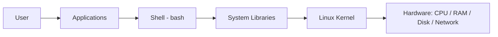

## 2. User ↔ Shell ↔ Kernel (Module 02)

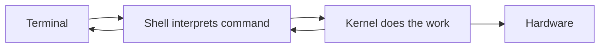

## 3. Filesystem Hierarchy (Module 02)

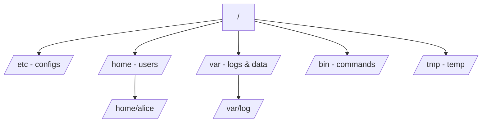

## 4. Permission Model (Module 04)

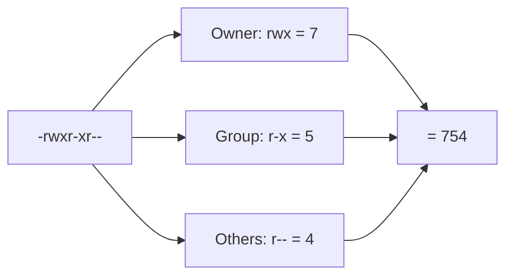

## 5. Process Lifecycle (Module 05)

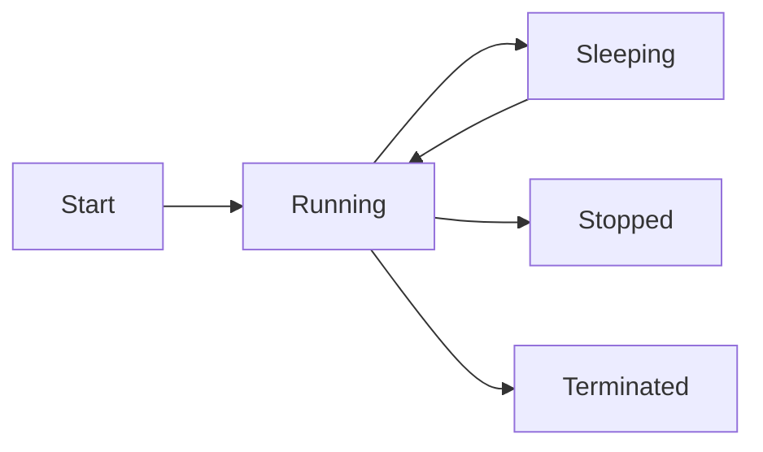

## 6. systemd Service Flow (Module 05)

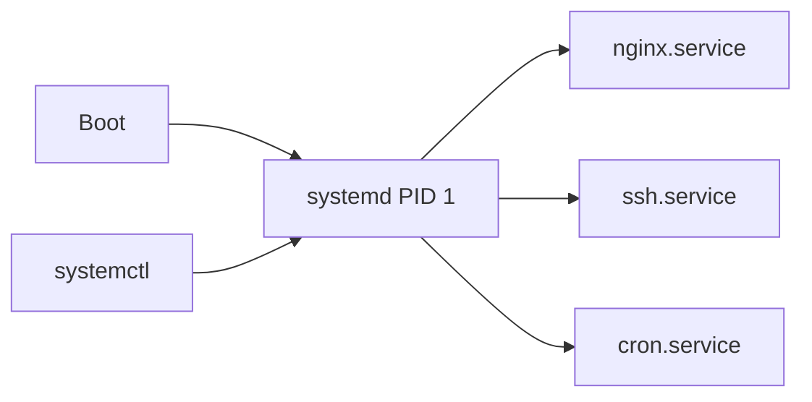

## 7. Package Installation Flow (Module 06)

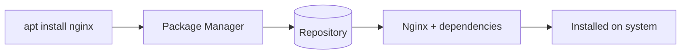

## 8. DNS Resolution Flow (Module 07)

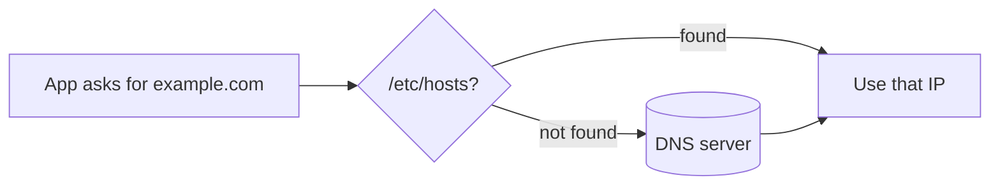

## 9. Client-Server Connection Flow (Module 07)

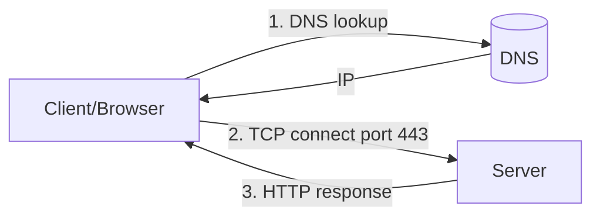

## 10. Disk Mount Flow (Module 08)

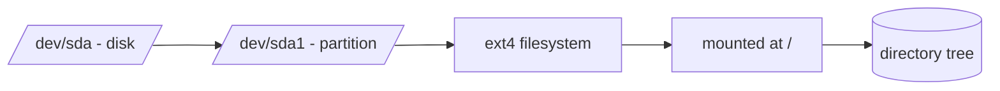

## 11. Log Troubleshooting Flow (Module 09)

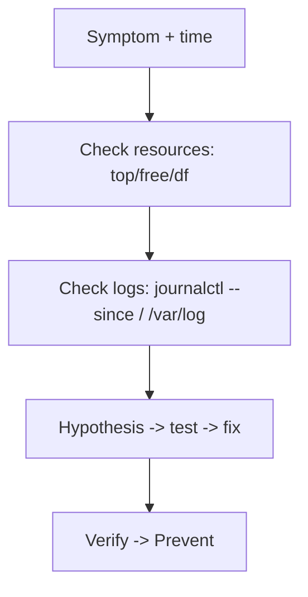

## 12. Cron Job Execution Flow (Module 11)

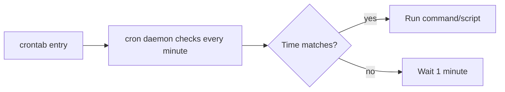

## 13. SSH Connection Flow (Module 12)

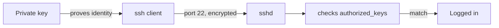

## 14. Linux in DevOps Workflow (Module 13)

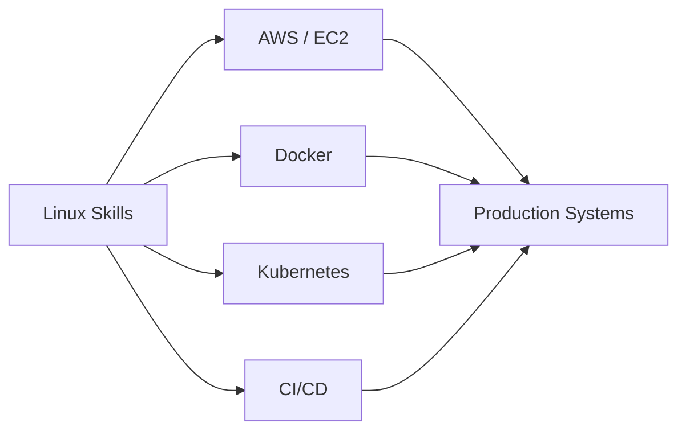

---

> Edit/preview these at the [Mermaid Live Editor](https://mermaid.live/). Keep diagrams simple and left-to-right for clarity.
